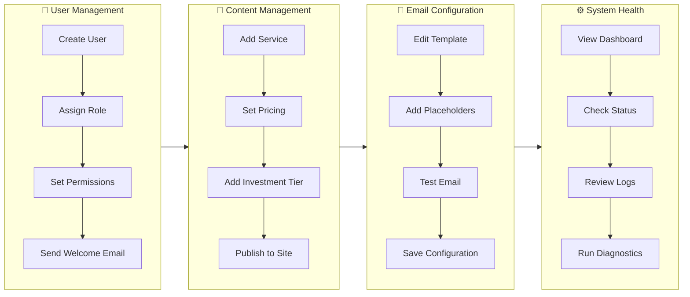
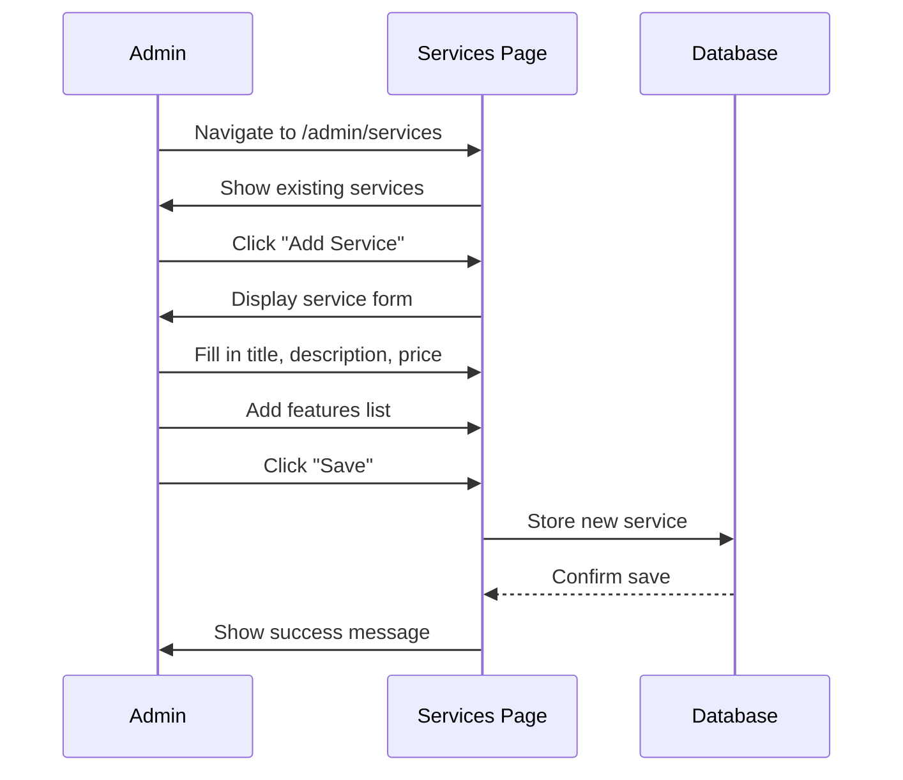
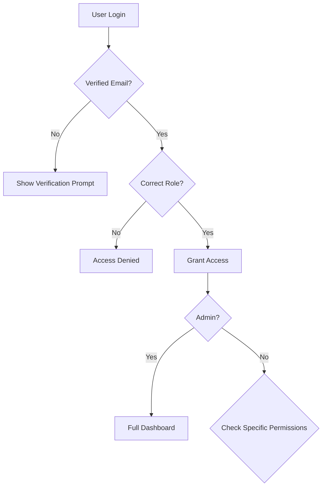
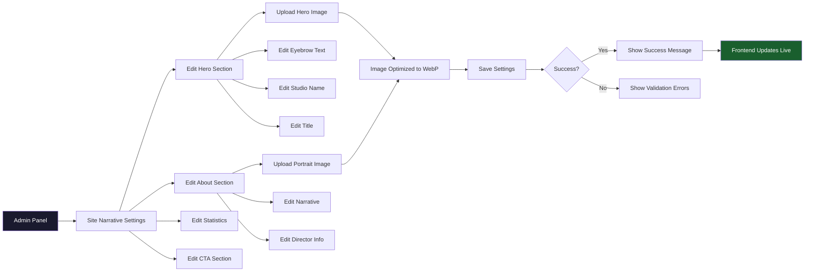
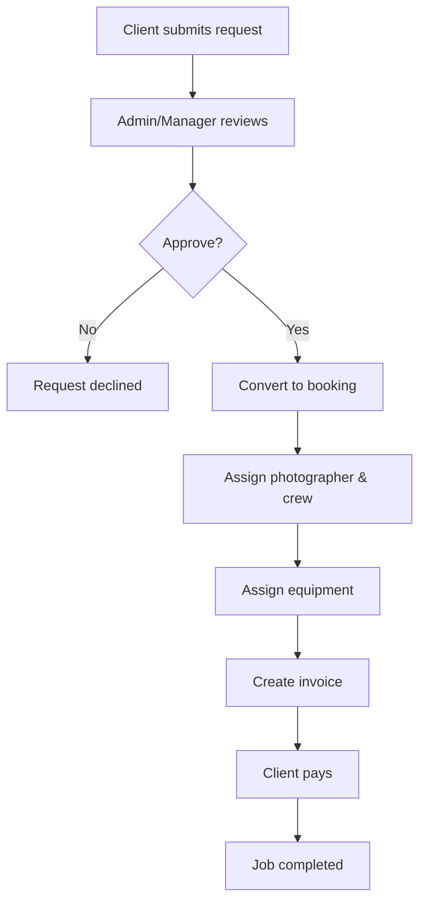

# Odo Studio Administrator Documentation

> **Welcome to the Admin Guide** — This comprehensive documentation covers everything you need to know about managing Odo Studio as an administrator.

---

## Table of Contents

1. [Role Definition & Permissions](#role-definition--permissions)
2. [Authentication & Authorization](#authentication--authorization)
3. [Dashboard & Navigation](#dashboard--navigation)
4. [Email Configuration](#email-configuration)
5. [Site Settings](#site-settings)
6. [System Health Monitoring](#system-health-monitoring)
7. [User Management](#user-management)
8. [Content Management](#content-management)
9. [Media Library](#media-library)
10. [Collections & Tags](#collections--tags)
11. [Equipment Management](#equipment-management)
12. [Booking & Invoice Overview](#booking--invoice-overview)
13. [Security Features](#security-features)
14. [Blade Components](#blade-components)

---

## Quick Visual Guide

> 💡 **Tip**: These visual workflows show the most common admin tasks. Click any step to jump to the detailed section.

### Common Admin Tasks



### Step-by-Step: Creating a New Service



### Step-by-Step: Configuring Email Templates

```mermaid
flowchart TD
    A[📧 Email Config] --> B[Navigate to Settings]
    B --> C[Select Email Type]
    C --> D[Edit Subject Line]
    D --> E[Edit Email Body]
    E --> F{Add Placeholders?}
    F -->|Yes| G[Insert &#123;name&#125;, &#123;date&#125;, etc.]
    F -->|No| H[Save Template]
    G --> H
    H --> I[Test with Preview]
    I --> J{Works Correctly?}
    J -->|Yes| K[✅ Active]
    J -->|No| E
```



---

## Role Definition & Permissions

### What is an Admin?

The Admin role represents the **highest level of access** in Odo Studio. As an administrator, you have complete control over all aspects of the system.

> 📋 **Key Responsibility**: Administrators ensure the system runs smoothly, manage team members, and configure business settings.

#### Admin Responsibilities

| Area | Description |
|------|-------------|
| **System** | Configuration, maintenance, health monitoring |
| **Users** | Create accounts, assign roles, manage access |
| **Content** | Services, projects, testimonials, pricing, process steps |
| **Communications** | Email templates, notifications |
| **Finances** | Invoices, bookings overview |
| **Assets** | Media library, collections, tags, equipment |

### Permissions

Administrators have full access through Spatie Laravel Permission. Here's what you can do:

```php
// Check user roles
$user->hasRole('admin');        // true for admins
$user->hasRole('manager');      // Can access if assigned
$user->hasRole('crew');         // Can access if assigned

// Check permissions
$user->can('manage users');      // Full user management
$user->can('configure email');   // Email templates
$user->can('view all invoices'); // Financial access
```

### User Model Attributes

The User model includes several attributes relevant to admin functions:

```php
// Core identification
$user->id;                    // Unique database ID
$user->name;                  // Full name
$user->email;                 // Login email

// Security
$user->email_verified_at;    // When email was verified
$user->must_change_password;  // Force password change on next login

// For photographers/crew
$user->crew_specialty;        // 'photographer', 'videographer', or 'both'

// Relationships
$user->roles;                 // Collection of assigned roles
$user->permissions;           // Direct permissions beyond roles
$user->deleted_at;           // Soft delete (null = active)
```

---

## Authentication & Authorization

### How Authentication Works

Odo Studio uses **Laravel Breeze** for authentication:

1. **Registration** — Disabled in production; users are created by admins only
2. **Login** — Email/password authentication
3. **Verification** — Email verification required before access
4. **Password Reset** — Self-service password reset via email
5. **Force Password Change** — New users must change password on first login

### Authorization Flow



### Role-Based Access Control (RBAC)

| Role | Access Level |
|------|-------------|
| `admin` | Full system access |
| `manager` | Bookings, invoices, requests, equipment |
| `crew` | Calendar, own bookings, media, equipment check-in |

### Site Settings Update Flow



---

## Dashboard & Navigation

### Admin Dashboard

When you log in as an admin, you'll see the main dashboard with:

- **Quick Stats** — User count, active bookings, pending requests
- **Recent Activity** — Latest bookings, invoices, user signups
- **System Status** — Health check indicators
- **Quick Actions** — Common admin tasks

### Navigation Structure

```
Admin Panel
├── Dashboard           → Overview & stats
├── Users               → User management
├── Booking Requests    → Review inquiries
├── Bookings            → Confirmed bookings
├── Invoices            → Financial documents
├── Media Library       → Photos, videos, motion graphics
│   └── Collections     → Virtual albums for organizing media
├── ─────────────
├── Content
│   ├── Services        → Service offerings
│   ├── Projects        → Portfolio items
│   ├── Testimonials    → Client reviews
│   ├── Pricing         → Investment tiers
│   └── Process         → Workflow steps
├── ─────────────
├── Equipment
│   ├── Items           → Inventory management
│   ├── Categories      → Equipment categories
│   └── Overdue Report  → Tracking overdue gear
├── ─────────────
├── Settings
│   ├── Email           → Email templates
│   └── Site            → Hero, about, CTA
└── System
    └── Health          → System vitals
```

---

## Email Configuration

### Overview

The email configuration system allows you to customize automated emails sent to clients and staff.

> ⚙️ **Location**: `Admin > Settings > Email Configuration`

### Available Templates

| Template | Trigger | Variables |
|----------|---------|-----------|
| **Booking Request Received** | Client submits inquiry | `{name}`, `{event_type}`, `{event_date}` |
| **Booking Confirmed** | Manager converts request to booking | `{name}`, `{event_date}`, `{location}` |
| **Invoice Created** | New invoice generated | `{invoice_number}`, `{amount}`, `{due_date}` |
| **Invoice Paid** | Payment recorded | `{invoice_number}`, `{amount}` |

### Placeholder Reference

Use these placeholders in your email templates:

```php
// Client information
{name}           → Client first name
{surname}        → Client last name  
{email}          → Client email
{phone}          → Client phone

// Event details
{event_type}     → Type of event (Wedding, Portrait, etc.)
{event_date}     → Date of event
{event_location} → Venue/location

// Booking details
{booking_date}   → Booking creation date
{booking_status} → Current status

// Financial
{invoice_number} → Unique invoice ID
{amount}         → Invoice total
{due_date}       → Payment deadline

// Company
{company_name}   → Your studio name
{company_email}  → Contact email
```

### Testing Emails

> 💡 **Pro Tip**: Always test email templates before saving!

1. Navigate to **Admin > Settings > Email Configuration**
2. Edit any template
3. Use the **Send Test Email** button
4. Verify the formatting and placeholders work correctly

### HTML Sanitization

All email template bodies are sanitized through HtmlPurifier to prevent XSS attacks. Scripts, iframes, and event handlers are automatically stripped.

---

## Site Settings

### Overview

Site settings control what appears on your public-facing website.

> 🎨 **Location**: `Admin > Settings > Site Settings`

### Settings Categories

#### Hero Section

| Field | Description | Example |
|-------|-------------|----------|
| Hero Title | Main headline | "Capture Your Moments" |
| Hero Subtitle | Tagline | "Professional Photography Services" |
| Hero CTA Text | Button text | "Book Now" |
| Hero CTA Link | Button destination | `/contact` |

#### About Section

| Field | Description |
|-------|-------------|
| About Title | Section heading |
| About Content | Main description (supports markdown) |
| About Image | Featured image |

#### Call-to-Action (CTA)

| Field | Description |
|-------|-------------|
| CTA Title | Promotional headline |
| CTA Text | Description text |
| CTA Button Text | Button label |
| CTA Button Link | Target URL |

---

## System Health Monitoring

### Overview

The System Vitals page provides real-time monitoring of core systems.

> 🏥 **Location**: `Admin > System > Health Check`

### Health Checks

| Component | Status Indicator | Details Shown |
|-----------|------------------|---------------|
| **Database** | Green/Red | Connection, driver, table count |
| **Cache** | Green/Red | Driver, read/write test, TTL |
| **Email** | Green/Yellow/Red | Configured templates |
| **Storage** | Green/Red | Permissions, disk access |
| **Roles** | Green/Yellow/Red | Role count, permissions |
| **Disk** | Green/Yellow/Red | Space usage percentage |
| **Queue** | Green/Yellow/Red | Failed/pending job counts |
| **Application** | Green/Red | Environment, PHP/Laravel versions |

### Health API Endpoints

Individual health checks are available via API for monitoring integrations:

| Endpoint | Description |
|----------|-------------|
| `/api/health/database` | Database connectivity |
| `/api/health/cache` | Cache system |
| `/api/health/email` | Email config |
| `/api/health/storage` | Storage system |
| `/api/health/roles` | Role system |
| `/api/health/disk` | Disk space |
| `/api/health/queue` | Queue status |
| `/api/health/application` | Application info |
| `/api/health/statistics` | System counts (users, bookings, etc.) |

### Running Health Checks

1. Navigate to **Admin > System > Health Check**
2. Click **Re-Initialize Vitals** to refresh all checks
3. Click any card to see detailed configuration info

### Interpreting Results

- ✅ **Green** — System operational
- ⚠️ **Yellow** — Partial functionality (e.g., no email templates)
- ❌ **Red** — System error requiring attention

---

## User Management

### Overview

Create and manage user accounts with role assignments.

> 👥 **Location**: `Admin > Users`

### Creating a User

1. Click **Add User** button
2. Fill in details:
   - Full Name
   - Email Address
   - Temporary Password
   - Role Assignment
   - Crew Specialty (for crew members)
3. User will be created with `must_change_password = true`
4. User must verify email and change password on first login

### Role Assignment

| Role | Use Case |
|------|----------|
| **Admin** | Full system management |
| **Manager** | Day-to-day operations |
| **Crew** | Creative team members (photographers/videographers) |

### Crew Specialty

When creating crew members, assign a specialty:

| Value | Description |
|-------|-------------|
| `photographer` | Still photography only |
| `videographer` | Video production only |
| `both` | Can work as either |

This ensures proper equipment assignment and booking allocation.

### Editing Users

> ✏️ **Tip**: You can edit user details, reset passwords, and change roles at any time.

---

## Content Management

### Services

> 📦 **Location**: `Admin > Content > Services`

Define your service offerings with:
- Service name
- Description
- Base pricing
- Icon
- Features list
- Display order

### Projects (Portfolio)

> 🖼️ **Location**: `Admin > Content > Projects`

Projects are the **only public-facing portfolio items**. They appear on `/portfolio` and showcase your work.

#### Workflow: Adding Work to Portfolio

1. **Upload media** to the Media Library
2. **Organize media** into Collections (internal only)
3. **Create a Project** with title, description, category
4. **Assign media** to the project (select from Media Library or assign from Collections view)
5. **Set hero image** — one media item as the project thumbnail
6. Project appears publicly on `/portfolio`

#### Project Fields

| Field | Description |
|-------|-------------|
| Title | Project name (required) |
| Slug | Auto-generated URL |
| Client | Client name (optional) |
| Location | Where the project was shot |
| Description | Project narrative |
| Category | Filterable category (e.g., Wedding, Brand) |
| Hero Media | Featured image/video for portfolio grid |
| Media Gallery | All media assigned to this project |
| Featured | Show at top of portfolio |
| Order | Display order |

#### Collections vs Projects

| Aspect | Collections | Projects |
|--------|-------------|----------|
| Purpose | Internal organization | Public showcase |
| Visibility | Admin only | Public on `/portfolio` |
| Media can belong to | Multiple collections | One project |
| Has hero image | No | Yes |

### Testimonials

> 💬 **Location**: `Admin > Content > Testimonials`

Client reviews with:
- Client name and initials
- Event label
- Star rating (1-5)
- Quote/testimonial text
- Featured flag
- Display order

### Investment Tiers

> 💰 **Location**: `Admin > Content > Pricing`

Package options:
- Tier label (short code)
- Full name
- Price
- Price suffix (e.g., "starting from")
- Featured flag and badge label
- Features list (JSON array)
- Display order

### Process Steps

> ⚡ **Location**: `Admin > Content > Process`

Workflow showcase:
- Step number
- Title
- Description
- Display order

---

## Media Library

### Overview

The media library is the central repository for all photos, videos, and motion graphics used throughout the system.

> 🖼️ **Location**: `Admin > Media Library`

### Supported Formats

| Type | Formats | Notes |
|------|---------|-------|
| **Images** | JPG, PNG, GIF, WebP | Auto-converted to WebP on upload |
| **Videos** | MP4, WebM | Auto-transcoded to WebM via ffmpeg.wasm |
| **Motion Graphics** | GIF, WebP (animated) | Animated content |

### Upload Workflow

1. Click **"+ Ingest Media"** button
2. Select file (images auto-convert to WebP, videos to WebM)
3. Enter title and media type
4. Optionally add tags (comma-separated)
5. Optionally assign to collections
6. Submit — client-side optimization runs before upload

### Media Library Features

- **Grid view** with 24 items per page
- **Bulk selection** — Select multiple items for batch operations
- **Hover overlay** showing title, type, tags, edit/delete actions
- **Search** by title, filename, or description
- **Filter** by media type (Stills, Video, Motion Graphics)
- **Filter** by collection (sidebar)
- **Filter** by tag (sidebar pills)
- **Edit metadata** per item (title, description, tags, collections)
- **Delete** with confirmation modal

#### Bulk Selection Workflow

1. Click **"Select All"** checkbox in header, or click individual media checkboxes
2. Floating action bar appears showing selected count
3. Click **"Add to Collection"** to bulk-add selected items to a collection
4. Click **"Clear"** to deselect all

> 💡 **Tip**: Bulk selection is useful when organizing media from an event shoot into collections.

### Media Usage

Media can be used in:
- Portfolio projects
- Hero sections
- About page
- Testimonials
- Email templates
- Site settings

### Media Policy

- **View**: Everyone (public portfolio)
- **Upload**: Admin and Crew roles
- **Edit**: Admin or the uploader
- **Delete**: Admin or the uploader

---

## Collections & Tags

### Overview

Collections and Tags provide powerful organization for your media library, allowing you to group, filter, and find assets quickly.

> ⚠️ **Important**: Collections are for **internal admin organization only**. They do NOT appear publicly on the website. Use **Projects** to showcase work publicly on `/portfolio`.

### Collections

> 📁 **Location**: `Admin > Collections`

Collections are virtual albums that group media items. A single media item can belong to multiple collections simultaneously.

**Use Case Example**: 
- Create collections like "Nonto Birthday Setup", "Nonto Birthday Ceremony"
- Both collections contain different assets for the same event
- Create a Project "Nonto's Birthday 2025" and assign media to it for public display

#### Creating a Collection

1. Navigate to **Admin > Collections**
2. Click **"+ New Collection"**
3. Enter collection name (required)
4. Optionally add description
5. Optionally pick a color (hex code)
6. Optionally select media to add to the collection
7. Save

#### Bulk Adding Media to Collections

You can add multiple media items to a collection at once:

1. Navigate to **Admin > Media Library**
2. Use the **"Select All"** checkbox in the header, or click individual media checkboxes
3. A floating action bar appears at the bottom
4. Click **"Add to Collection"**
5. Select a collection from the modal
6. Confirm — all selected media is added to the collection

#### Collection Features

| Feature | Description |
|---------|-------------|
| **Name** | Display name for the collection |
| **Slug** | Auto-generated URL-friendly identifier |
| **Description** | Optional notes about the collection |
| **Color** | Optional hex color for visual identification |
| **Media Count** | Number of items in the collection |
| **Media Selection** | Add media during creation or editing |

#### Managing Collections

- **Edit**: Click Edit on any collection card
- **Delete**: Removes the collection (media files are NOT deleted)
- **Filter**: Click a collection in the Media Library sidebar to filter
- **Bulk Actions**: Use Media Library to add/remove media in bulk

### Tags

Tags are flexible labels applied to individual media items for cross-cutting categorization.

#### Adding Tags

- **On Upload**: Enter comma-separated tags in the upload form
- **On Edit**: Edit any media item and update its tags
- **Auto-create**: New tags are created automatically if they don't exist

#### Using Tags

- **Filter**: Click tag pills in the Media Library sidebar
- **Portfolio**: Public portfolio supports `?tag=slug` filtering
- **Search**: Tags are included in media search results

### Tag API

For programmatic tag management:

| Endpoint | Method | Purpose |
|----------|--------|---------|
| `/api/tags?q=...` | GET | Search tags (autocomplete) |
| `/api/tags` | POST | Create a new tag |

---

## Equipment Management

### Overview

The equipment management system tracks all photography and videography gear, manages inventory, and assigns equipment to bookings.

> 🎒 **Location**: `Admin > Equipment`

### Equipment Categories

> 📂 **Location**: `Admin > Equipment > Categories`

Organize equipment into categories:
- Category name and slug
- Description
- Icon
- Sort order

### Equipment Items

> 📷 **Location**: `Admin > Equipment > Items`

Full inventory tracking for each piece of equipment:

| Field | Description |
|-------|-------------|
| Name | Equipment name |
| Model | Model number |
| Serial Number | Unique serial |
| SKU | Stock keeping unit |
| Purchase Price | Original cost |
| Purchase Date | When acquired |
| Condition | Current condition |
| Status | Available / Maintenance / Retired / Checked Out |
| Specifications | Technical details (JSON) |
| Storage Location | Where it's stored |
| Maintenance Dates | Last and next maintenance |
| Notes | Additional information |
| Images | Multiple photos per item |

### Equipment Statuses

| Status | Description |
|--------|-------------|
| `available` | Ready for assignment |
| `checked_out` | Currently assigned to a booking |
| `maintenance` | Undergoing maintenance |
| `retired` | No longer in use |

### Assigning Equipment to Bookings

> 📋 **Location**: `Manager > Bookings > Assign Equipment`

1. Navigate to a booking detail
2. Click **Assign Equipment**
3. Select available equipment
4. Equipment is validated against crew specialty (photography gear → photographers, video gear → videographers)
5. Equipment is automatically suggested based on the booking's investment tier

### Equipment Check-In

> ✅ **Location**: `Photographer > My Gear`

Photographers can check in equipment they have checked out:
1. View current assigned gear
2. Click **Check In** on any item
3. Record condition on return and notes

### Overdue Equipment Report

> ⚠️ **Location**: `Admin > Equipment > Overdue Report`

Track all equipment that is past its expected return date.

---

## Booking & Invoice Overview

### Booking Flow



### Multi-Crew Bookings

Bookings can have multiple crew members:
- **Primary photographer** — Set from the first assigned photographer
- **Additional photographers** — Multiple photographers per booking
- **Videographers** — Separate video crew
- **Assistants** — Support roles

Crew confirmation emails are sent to ALL assigned members.

### Invoice Statuses

| Status | Meaning |
|--------|---------|
| **Draft** | Not yet sent to client |
| **Sent** | Delivered to client |
| **Paid** | Payment received |
| **Overdue** | Past due date, unpaid |
| **Cancelled** | Cancelled |

### PDF Generation

Invoices can be exported as PDFs using DomPDF. PDFs are automatically attached to invoice emails.

---

## Security Features

### Implemented Security Measures

- **Password Hashing** — Bcrypt hashing (not MD5/SHA)
- **Email Verification** — Required before account access
- **Force Password Change** — New users must change password on first login
- **Role-Based Access** — Prevents unauthorized actions
- **CSRF Protection** — Laravel built-in
- **SQL Injection Prevention** — Eloquent ORM
- **XSS Prevention** — Blade escaping + HtmlPurifier for rich text
- **Cross-Origin Isolation** — COOP/COEP headers on admin routes

### Rate Limiting

| Endpoint | Limit |
|----------|-------|
| Contact Form | 5 requests/minute |
| Invoice Creation | 10 requests/minute |
| Admin Config Updates | 5 requests/minute |
| Invoice Mark as Sent | 20 requests/minute |
| Invoice Mark as Paid | 20 requests/minute |
| Booking Creation | 10 requests/minute |

---

## Blade Components

### Overview

Odo Studio uses reusable Blade components for consistent UI patterns across the application.

### Available Components

| Component | Usage | Description |
|-----------|-------|-------------|
| `<x-btn>` | Button | Primary, secondary, danger, ghost variants with loading states |
| `<x-input>` | Form fields | Text, textarea, select, checkbox, radio with labels and errors |
| `<x-card>` | Container | Default, glass, flat, service, testimonial variants |
| `<x-badge>` | Labels | Gold, success, danger, warning, info with optional pulse |
| `<x-modal>` | Dialogs | Consolidated modal for alerts and confirmations |
| `<x-toast>` | Notifications | Individual toast notifications |
| `<x-toast-container>` | Notification area | Auto-managed toast stack |
| `<x-skeleton>` | Loading states | Text, title, avatar, card, image placeholders |
| `<x-hero>` | Hero section | Cinematic hero with animated orbs |
| `<x-process-section>` | Process steps | Numbered workflow steps |

### Component Examples

```blade
{{-- Buttons --}}
<x-btn variant="primary">Save Changes</x-btn>
<x-btn variant="danger" loading>Deleting...</x-btn>
<x-btn variant="ghost" href="/settings">Settings</x-btn>

{{-- Inputs --}}
<x-input label="Email" name="email" type="email" :error="$errors->first('email')" />

{{-- Cards --}}
<x-card variant="glass" hoverable>Content</x-card>

{{-- Badges --}}
<x-badge variant="gold" pulse>Featured</x-badge>

{{-- Skeletons --}}
<x-skeleton type="text" count="3" />
<x-skeleton-card>
    <x-skeleton type="image" />
    <x-skeleton type="title" class="mt-4" />
</x-skeleton-card>
```

---

## Getting Help

### Need Assistance?

If you encounter issues:

1. **Check System Health** — Run health checks first
2. **Review Logs** — Check `storage/logs` for errors
3. **Consult Architecture Doc** — See `/docs/architecture` for technical details

> 📖 **Related Documentation**: [Manager Guide](/docs/manager) | [Photographer Guide](/docs/photographer) | [Architecture](/docs/architecture)
