# Odo Studio System Architecture Documentation

## Overview

This document provides a comprehensive overview of the Odo Studio system architecture, including the tech stack, directory structure, database schema, authentication flow, and integration patterns.

---

## Table of Contents

1. [Technology Stack](#technology-stack)
2. [Project Structure](#project-structure)
3. [Database Schema](#database-schema)
4. [Authentication & Authorization](#authentication--authorization)
5. [Role-Based Access Control](#role-based-access-control)
6. [Email System](#email-system)
7. [File Storage](#file-storage)
8. [Queue System](#queue-system)
9. [Frontend Architecture](#frontend-architecture)
10. [API Structure](#api-structure)
11. [Testing](#testing)
12. [Deployment](#deployment)
13. [Related Documentation](#related-documentation)

---

## Visual Data Flow

> 💡 **Tip**: This section shows how data flows through the entire Odo Studio system.

### Complete System Data Flow

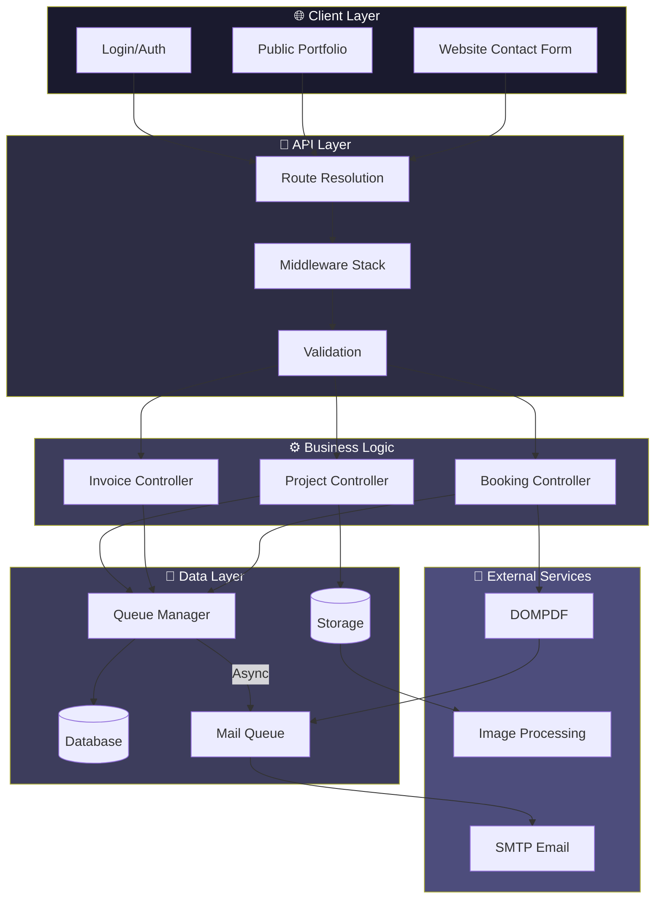

### Request Lifecycle

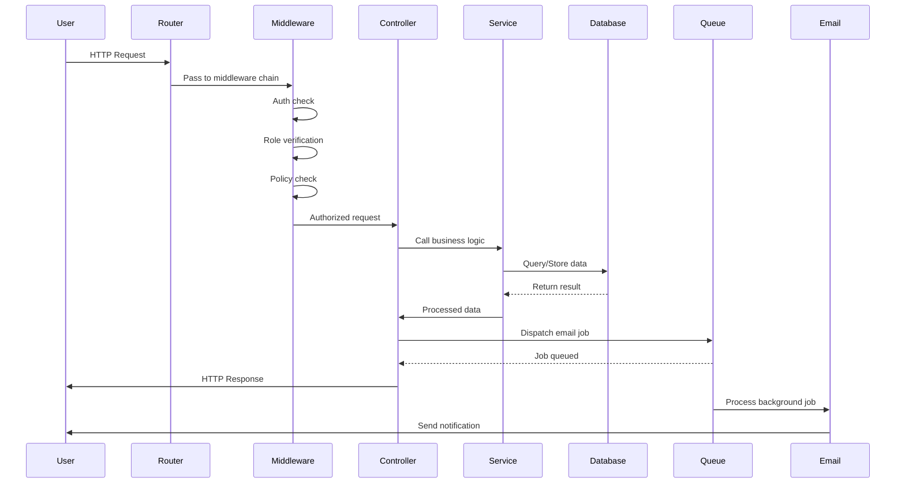

### Booking State Transitions

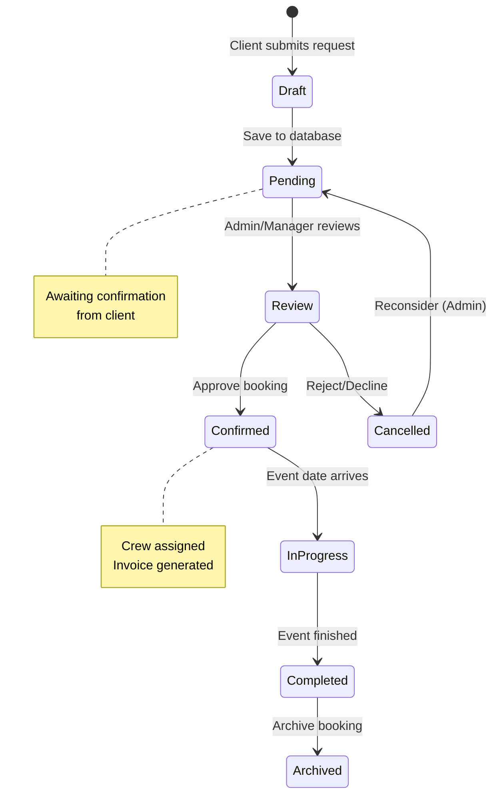

---

## Technology Stack

### Core Framework

| Component | Technology | Version |
|-----------|------------|---------|
| PHP | PHP | 8.5.2 |
| Framework | Laravel | 12.x |
| Database | SQLite (dev) / MySQL (prod) | - |
| Queue | Database (dev) / Redis (prod) | - |

### Authentication & Permissions

| Component | Package | Purpose |
|-----------|---------|---------|
| Authentication | Laravel Breeze | User authentication |
| Roles/Permissions | Spatie Laravel Permission | Role-based access |
| Email Verification | Laravel Built-in | Email verification |

### Frontend

| Component | Technology | Version |
|-----------|------------|---------|
| CSS | Tailwind CSS | 4.x (CSS-first config) |
| JavaScript | Alpine.js | 3.x |
| Build Tool | Vite | - |
| Fonts | Google Fonts (Outfit, Cormorant Garamond) | - |

### Additional Packages

| Package | Purpose |
|---------|---------|
| Laravel Pint | Code formatting |
| Laravel Horizon | Queue monitoring (production) |
| DomPDF | PDF generation |
| Intervention Image | Image processing |
| Mews Purifier | HTML sanitization |
| FullCalendar | Calendar view (photographer) |

---

## Project Structure

### Root Directory

```
Odo Studio/
├── app/                    # Application code
├── bootstrap/              # Application bootstrap
├── config/                 # Configuration files
├── database/               # Migrations, seeders, factories
├── docs/                   # Documentation
├── lang/                   # Language files
├── public/                 # Public assets
├── resources/              # Views, CSS, JS
├── routes/                 # Route definitions
├── storage/                # Logs, cached, uploads
├── tests/                  # Test suites
├── vendor/                 # Composer dependencies
├── artisan                 # CLI entry point
├── composer.json           # Dependencies
└── vite.config.js         # Vite configuration
```

### App Directory

```
app/
├── Console/
│   └── Commands/          # Artisan commands
├── Events/                # Event classes
├── Exceptions/            # Exception handlers
├── Http/
│   ├── Controllers/       # Controllers
│   ├── Middleware/       # Custom middleware
│   ├── Requests/         # Form requests
│   └── Resources/        # API resources
├── Jobs/                  # Queue jobs
├── Listeners/            # Event listeners
├── Mail/                 # Mail classes
├── Models/               # Eloquent models
├── Notifications/        # Notification classes
├── Policies/             # Authorization policies
├── Providers/            # Service providers
├── Rules/                # Custom validation rules
└── Services/             # Business logic services
```

### Key Directories

| Directory | Purpose |
|-----------|---------|
| `app/Http/Controllers/` | All HTTP controllers |
| `app/Models/` | All Eloquent models |
| `app/Policies/` | Authorization policies |
| `app/Mail/` | Email classes |
| `resources/views/` | Blade templates |
| `resources/views/components/` | Reusable Blade components |
| `routes/` | Route definitions |
| `database/migrations/` | Database migrations |

---

## Database Schema

### Entity Relationship Diagram

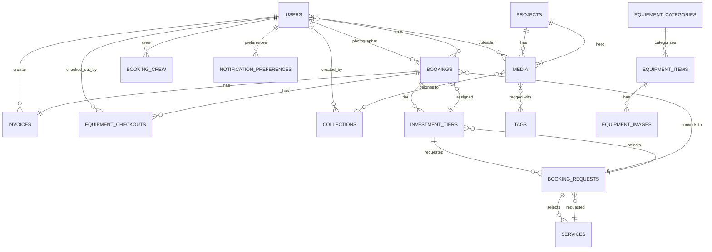

### Core Tables

#### Users Table

| Column | Type | Description |
|--------|------|-------------|
| `id` | bigint | Primary key |
| `name` | string | User full name |
| `email` | string | Email (unique) |
| `password` | string | Bcrypt hash |
| `email_verified_at` | timestamp | When email was verified |
| `must_change_password` | boolean | Force password change |
| `crew_specialty` | string | Specialty (photographer/videographer/both) |
| `created_at` | timestamp | Creation timestamp |
| `updated_at` | timestamp | Update timestamp |
| `deleted_at` | timestamp | Soft delete |

#### Roles & Permissions (Spatie)

| Table | Description |
|-------|-------------|
| `roles` | Role definitions |
| `permissions` | Permission definitions |
| `model_has_roles` | User-role mapping |
| `model_has_permissions` | User-permission mapping |
| `role_has_permissions` | Role-permission mapping |

### Booking System Tables

#### booking_requests

| Column | Type | Description |
|--------|------|-------------|
| `id` | bigint | Primary key |
| `name` | string | Client first name |
| `surname` | string | Client surname |
| `email` | string | Client email |
| `phone` | string | Client phone |
| `status` | string | Request status |
| `event_date` | date | Event date |
| `event_type` | string | Event type |
| `event_location` | string | Event location |
| `notes` | string | Additional notes |
| `email_sent_at` | timestamp | When notification sent |
| `service_id` | bigint | FK to services |
| `investment_tier_id` | bigint | FK to investment_tiers |

#### bookings

| Column | Type | Description |
|--------|------|-------------|
| `id` | bigint | Primary key |
| `booking_request_id` | bigint | FK to booking_requests |
| `investment_tier_id` | bigint | FK to investment_tiers |
| `photographer_id` | bigint | FK to users (primary) |
| `event_date` | date | Event date |
| `location` | string | Event location |
| `rate` | integer | Agreed rate (cents) |
| `status` | string | Booking status |
| `created_by` | bigint | FK to users |
| `deleted_at` | timestamp | Soft delete |

#### booking_crew (Pivot)

| Column | Type | Description |
|--------|------|-------------|
| `booking_id` | bigint | FK to bookings |
| `user_id` | bigint | FK to users |
| `role` | string | Role (photographer/videographer/assistant) |

#### invoices

| Column | Type | Description |
|--------|------|-------------|
| `id` | bigint | Primary key |
| `booking_id` | bigint | FK to bookings |
| `invoice_number` | string | Unique invoice number |
| `rate` | integer | Invoice amount (cents) |
| `total_amount` | integer | Total including fees |
| `status` | string | Invoice status |
| `notes` | string | Additional notes |
| `pdf_path` | string | Path to generated PDF |
| `issued_at` | timestamp | When issued |
| `paid_at` | timestamp | When paid |
| `created_by` | bigint | FK to users |
| `deleted_at` | timestamp | Soft delete |

### Portfolio Tables

#### projects

| Column | Type | Description |
|--------|------|-------------|
| `id` | bigint | Primary key |
| `title` | string | Project title |
| `slug` | string | URL slug (unique) |
| `client` | string | Client name |
| `location` | string | Project location |
| `description` | string | Project description |
| `hero_media_id` | bigint | FK to media |
| `category` | string | Project category |
| `is_featured` | boolean | Show in portfolio |
| `order` | integer | Display order |

> **Note:** Projects are the **only public-facing portfolio items**. Media must be assigned to a Project to appear on `/portfolio`.

#### media

| Column | Type | Description |
|--------|------|-------------|
| `id` | bigint | Primary key |
| `file_path` | string | Storage path |
| `file_name` | string | Original filename |
| `file_type` | string | MIME type |
| `title` | string | Media title |
| `description` | string | Media description |
| `uploaded_by` | bigint | FK to users |
| `media_type` | enum | image/gif/video |
| `project_id` | bigint | FK to projects (nullable) |

#### collections

| Column | Type | Description |
|--------|------|-------------|
| `id` | bigint | Primary key |
| `name` | string | Collection name |
| `slug` | string | URL slug (unique) |
| `description` | text | Collection description |
| `color` | string | Hex color code (e.g., #c9a84c) |
| `user_id` | bigint | FK to users (creator) |

> **Note:** Collections are for **internal admin organization only**. They are NOT displayed publicly. Use Projects for public portfolio showcase.

#### collection_media (Pivot)

| Column | Type | Description |
|--------|------|-------------|
| `id` | bigint | Primary key |
| `collection_id` | bigint | FK to collections |
| `media_id` | bigint | FK to media |
| `order` | integer | Sort order within collection |

#### tags

| Column | Type | Description |
|--------|------|-------------|
| `id` | bigint | Primary key |
| `name` | string | Tag name (unique) |
| `slug` | string | URL slug (unique) |

#### media_tags (Pivot)

| Column | Type | Description |
|--------|------|-------------|
| `id` | bigint | Primary key |
| `media_id` | bigint | FK to media |
| `tag_id` | bigint | FK to tags |

### Business Configuration Tables

#### services

| Column | Type | Description |
|--------|------|-------------|
| `id` | bigint | Primary key |
| `title` | string | Service name |
| `description` | string | Service description |
| `icon` | string | Icon identifier |
| `starting_price` | integer | Starting price (cents) |
| `features` | json | Feature list |
| `order` | integer | Display order |

#### investment_tiers

| Column | Type | Description |
|--------|------|-------------|
| `id` | bigint | Primary key |
| `tier_label` | string | Short label |
| `name` | string | Full name |
| `price` | integer | Price (cents) |
| `price_suffix` | string | Price suffix |
| `is_featured` | boolean | Featured flag |
| `badge_label` | string | Badge text |
| `features` | json | Feature list |
| `order` | integer | Display order |

#### testimonials

| Column | Type | Description |
|--------|------|-------------|
| `id` | bigint | Primary key |
| `client_name` | string | Client name |
| `client_initials` | string | Avatar initials |
| `event_label` | string | Event description |
| `rating` | integer | Star rating (1-5) |
| `quote` | string | Testimonial text |
| `is_featured` | boolean | Show on home |
| `order` | integer | Display order |

#### process_steps

| Column | Type | Description |
|--------|------|-------------|
| `id` | bigint | Primary key |
| `step_number` | string | Step identifier |
| `title` | string | Step title |
| `description` | string | Step description |
| `display_order` | integer | Sort order |
| `deleted_at` | timestamp | Soft delete |

### Equipment Management Tables

#### equipment_categories

| Column | Type | Description |
|--------|------|-------------|
| `id` | bigint | Primary key |
| `name` | string | Category name |
| `slug` | string | URL slug (unique) |
| `description` | text | Category description |
| `icon` | string | Icon identifier |
| `sort_order` | integer | Display order |

#### equipment_items

| Column | Type | Description |
|--------|------|-------------|
| `id` | bigint | Primary key |
| `category_id` | bigint | FK to equipment_categories |
| `name` | string | Equipment name |
| `model` | string | Model number |
| `serial_number` | string | Unique serial |
| `sku` | string | Stock keeping unit |
| `purchase_price` | integer | Original cost (cents) |
| `purchase_date` | date | When acquired |
| `condition` | string | Current condition |
| `status` | enum | available/maintenance/retired/checked_out |
| `specifications` | json | Technical details |
| `storage_location` | string | Where stored |
| `last_maintenance` | date | Last maintenance date |
| `next_maintenance` | date | Next scheduled maintenance |
| `notes` | text | Additional notes |
| `deleted_at` | timestamp | Soft delete |

#### equipment_checkouts

| Column | Type | Description |
|--------|------|-------------|
| `id` | bigint | Primary key |
| `booking_id` | bigint | FK to bookings |
| `equipment_item_id` | bigint | FK to equipment_items |
| `user_id` | bigint | FK to users (checked out by) |
| `checked_out_at` | timestamp | When checked out |
| `expected_return_at` | timestamp | Expected return date |
| `returned_at` | timestamp | Actual return date |
| `condition_out` | string | Condition when checked out |
| `condition_in` | string | Condition when returned |
| `checkout_notes` | text | Checkout notes |
| `return_notes` | text | Return notes |
| `status` | string | Checkout status |

#### equipment_images

| Column | Type | Description |
|--------|------|-------------|
| `id` | bigint | Primary key |
| `equipment_item_id` | bigint | FK to equipment_items |
| `image_path` | string | Storage path |
| `is_primary` | boolean | Primary image flag |
| `sort_order` | integer | Display order |

### Configuration Tables

#### site_settings

| Column | Type | Description |
|--------|------|-------------|
| `id` | bigint | Primary key |
| `key` | string | Setting key |
| `value` | string | Setting value |

#### email_configurations

| Column | Type | Description |
|--------|------|-------------|
| `id` | bigint | Primary key |
| `key` | string | Config key |
| `value` | text | Encrypted value |

#### notification_preferences

| Column | Type | Description |
|--------|------|-------------|
| `id` | bigint | Primary key |
| `user_id` | bigint | FK to users |
| `notify_new_requests` | boolean | Notification flag |

---

## Authentication & Authorization

### Authentication Flow

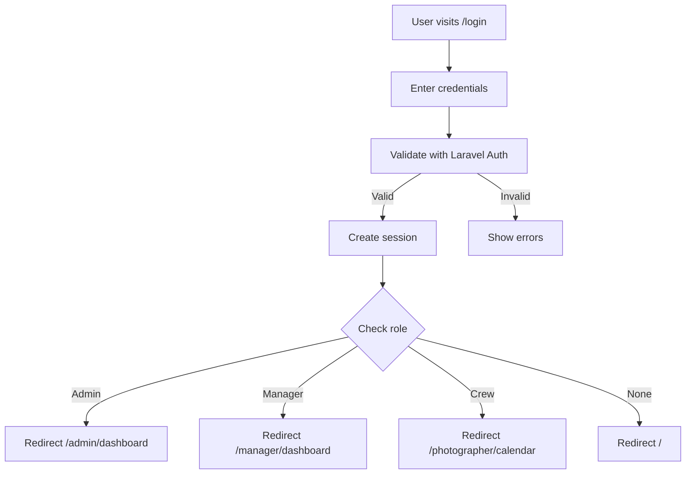

### Authorization Layers

1. **Authentication** - Is user logged in?
2. **Email Verification** - Has user verified email?
3. **Role Check** - Does user have required role?
4. **Policy Check** - Can user perform this action?

### Middleware Stack

```
Request → auth → verified → role:xxx → policy → Controller
```

---

## Role-Based Access Control

### Role Permissions Matrix

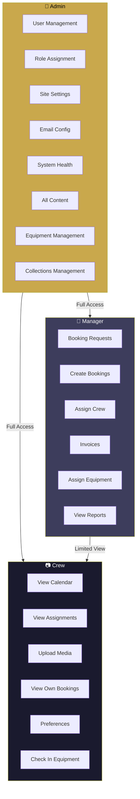

### Permission Check Flow

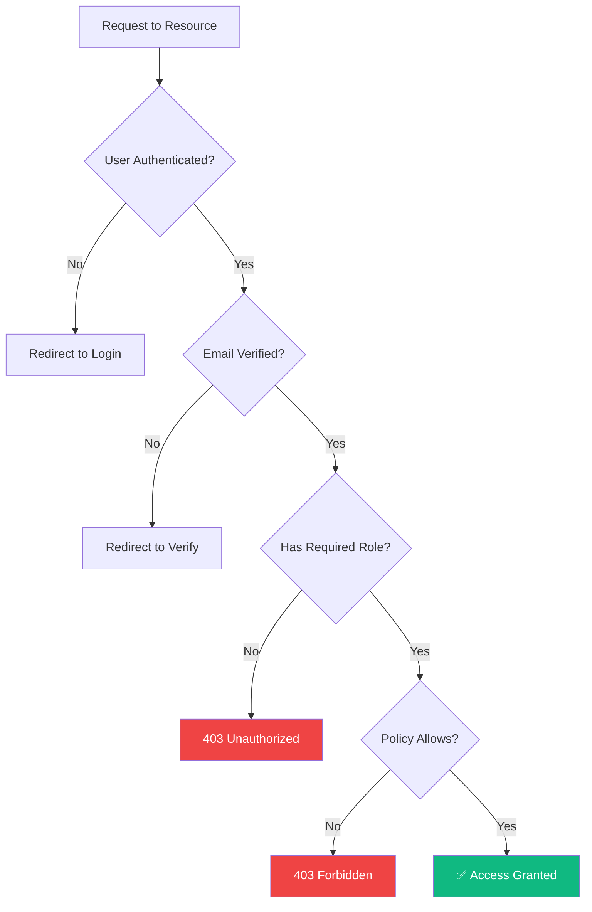

### Role Hierarchy

```
👑 Admin
├── Full system access
├── Can assign roles
├── Can manage all data
└── Can manage equipment & collections

👔 Manager
├── Booking management
├── Invoice management
├── Equipment assignment
└── Cannot access admin functions

📷 Crew (Photographer/Videographer)
├── View calendar
├── Upload media
├── View own data
└── Check in equipment
```

### Permission Model

Using Spatie Laravel Permission:

```php
// Check role
$user->hasRole('admin');

// Check permission
$user->hasPermissionTo('edit posts');

// Check role OR permission
$user->hasRoleOrPermission('edit posts');
```

---

## Email System

### Email Classes

| Class | Purpose |
|-------|---------|
| `BookingRequestMail` | Notify admin of new request |
| `RequestReceivedMail` | Confirm request to client |
| `BookingConfirmedMail` | Notify crew of assignment |
| `InvoiceSentMail` | Send invoice with PDF attachment |

### Email Queue

All emails are queued asynchronously:

```php
class BookingRequestMail extends Mailable implements ShouldQueue
{
    // Job dispatched to queue
}
```

### Email Configuration

Templates are stored in database:

```php
EmailConfiguration::getConfig('booking_request_subject');
EmailConfiguration::getConfig('booking_request_body');
```

### Placeholder Processing

```php
// All placeholders are HTML-escaped for XSS protection
str_replace('{name}', e($data['name']), $template);
```

### HTML Sanitization

Email template bodies are sanitized through HtmlPurifier (Mews Purifier) to prevent XSS attacks. Scripts, iframes, and event handlers are automatically stripped.

---

## File Storage

### Storage Disks

| Disk | Driver | Purpose |
|------|--------|---------|
| `public` | local | Publicly accessible files (media, equipment images) |
| `local` | local | Application files |

### Directory Structure

```
storage/app/public/
├── media/                    # Media library files
│   └── {random-filename}.webp
├── equipment/                # Equipment images
│   └── {random-filename}.webp
└── site/                     # Site settings images
    └── {random-filename}.webp
```

### Storage Link

```bash
php artisan storage:link
```

Creates symlink from `public/storage` to `storage/app/public`

---

## Queue System

### Queue Configuration

| Environment | Driver |
|-------------|--------|
| Development | database |
| Production | redis |

### Queue Jobs

| Job | Description |
|-----|-------------|
| `SendBookingRequestEmail` | Send booking request notification |
| `SendRequestReceivedMail` | Send client confirmation |
| `SendBookingConfirmedMail` | Send crew notification |
| `SendInvoiceSentMail` | Send invoice with PDF |

### Queue Processing

```bash
# Process queue
php artisan queue:work

# Listen for jobs
php artisan queue:listen
```

---

## Frontend Architecture

### Template Engine

Using Blade templates:

```
resources/views/
├── layouts/
│   ├── app.blade.php      # Authenticated layout
│   └── guest.blade.php    # Public layout
├── components/            # Reusable components
│   ├── btn.blade.php      # Button variants
│   ├── input.blade.php    # Form inputs
│   ├── card.blade.php     # Card containers
│   ├── badge.blade.php    # Status badges
│   ├── modal.blade.php    # Modal dialogs
│   ├── toast.blade.php    # Toast notifications
│   ├── toast-container.blade.php
│   ├── skeleton.blade.php # Loading states
│   ├── skeleton-card.blade.php
│   ├── skeleton-list.blade.php
│   ├── hero.blade.php     # Hero section
│   └── process-section.blade.php
├── admin/                 # Admin views
├── manager/               # Manager views
├── photographer/          # Photographer views
├── emails/                # Email templates
└── *.blade.php            # Various views
```

### Styling

Tailwind CSS v4 with CSS-first configuration:

```css
/* resources/css/app.css */
@import 'tailwindcss';

@theme {
    --color-gold: #c9a84c;
    --color-charcoal: #111111;
    --font-sans: 'Outfit', ui-sans-serif, system-ui, sans-serif;
    --font-serif: 'Cormorant Garamond', ui-serif, Georgia, serif;
    
    /* Duration tokens */
    --duration-fast: 200ms;
    --duration-normal: 300ms;
    --duration-slow: 500ms;
    --duration-deliberate: 700ms;
    
    /* Easing tokens */
    --ease-premium: cubic-bezier(0.16, 1, 0.3, 1);
    --ease-reveal: cubic-bezier(0.165, 0.84, 0.44, 1);
}
```

### Interactivity

Alpine.js for client-side behavior:

```html
<div x-data="{ open: false }">
    <button @click="open = !open">Toggle</button>
</div>
```

### Client-Side Media Optimization

- **Images**: Canvas API converts to WebP (max 4096px, 80% quality)
- **Videos**: ffmpeg.wasm transcodes to WebM (VP9 codec, CRF 30)
- Both run in-browser before upload to reduce server load

---

## API Structure

### Health Check API

| Endpoint | Method | Auth | Description |
|----------|--------|------|-------------|
| `/api/health/database` | GET | Admin | Database connectivity |
| `/api/health/cache` | GET | Admin | Cache system |
| `/api/health/email` | GET | Admin | Email config |
| `/api/health/storage` | GET | Admin | Storage system |
| `/api/health/roles` | GET | Admin | Role system |
| `/api/health/disk` | GET | Admin | Disk space |
| `/api/health/queue` | GET | Admin | Queue status |
| `/api/health/application` | GET | Admin | Application info |
| `/api/health/statistics` | GET | Admin | System counts |

### Tag API

| Endpoint | Method | Auth | Description |
|----------|--------|------|-------------|
| `/api/tags?q=...` | GET | Admin/Crew | Tag search (autocomplete) |
| `/api/tags` | POST | Admin/Crew | Create new tag |

### Calendar API

| Endpoint | Method | Auth | Description |
|----------|--------|------|-------------|
| `/photographer/calendar/events` | GET | Crew | FullCalendar JSON events |

### Response Format

```json
{
    "status": "pass|fail|warning",
    "message": "Description",
    "timestamp": "2024-01-15T10:30:00Z"
}
```

---

## Testing

### Test Structure

```
tests/
├── Feature/               # Feature tests
│   ├── BookingRequestTest.php
│   ├── MediaManagementTest.php
│   └── ...
└── Unit/                 # Unit tests
    ├── BookingTest.php
    ├── MediaTest.php
    └── ...
```

### Running Tests

```bash
# All tests
php artisan test

# Specific test file
php artisan test tests/Feature/MediaManagementTest.php

# Specific test by name
php artisan test --filter=testName
```

### Test Database

Tests use in-memory SQLite for speed:

```php
// phpunit.xml
<env name="DB_CONNECTION" value="sqlite"/>
<env name="DB_DATABASE" value=":memory:"/>
```

---

## Deployment

### Production Setup

1. **Server Requirements**
   - PHP 8.5+
   - Composer
   - Node.js + NPM
   - Database (MySQL/PostgreSQL)
   - Redis (for queues)

2. **Environment Configuration**
   ```
   APP_ENV=production
   APP_DEBUG=false
   DB_CONNECTION=mysql
   QUEUE_CONNECTION=redis
   ```

3. **Deployment Steps**
   ```bash
   composer install --optimize-autoloader
   npm run build
   php artisan migrate --force
   php artisan storage:link
   php artisan config:cache
   php artisan route:cache
   php artisan view:cache
   ```

### Development Commands

```bash
# Start development
composer run dev

# Run tests
php artisan test

# Format code
vendor/bin/pint --dirty --format agent

# Clear caches
php artisan optimize:clear
```

---

## Visual Models

### Class Diagram - Core Models

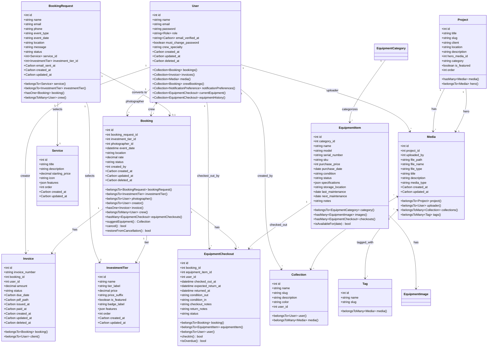

### State Machine - Booking Workflow

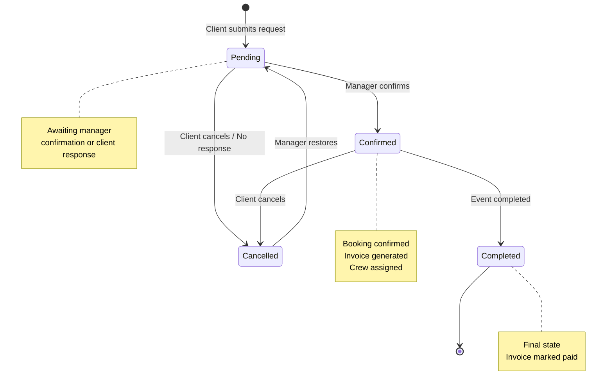

### State Machine - Invoice Workflow

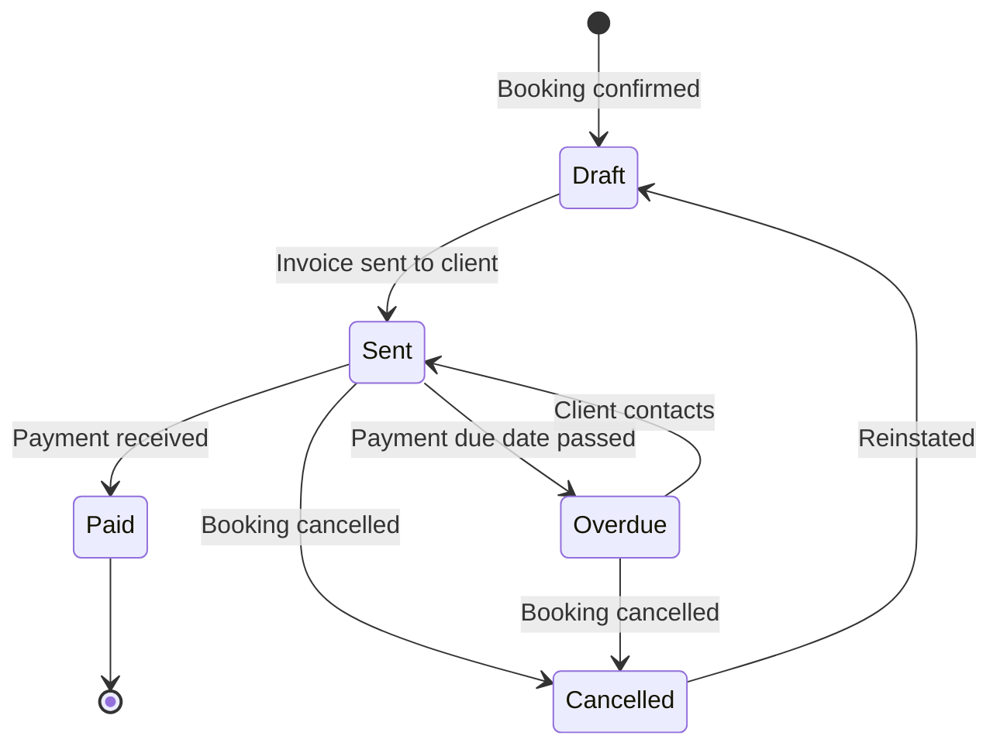

### System Architecture Diagram

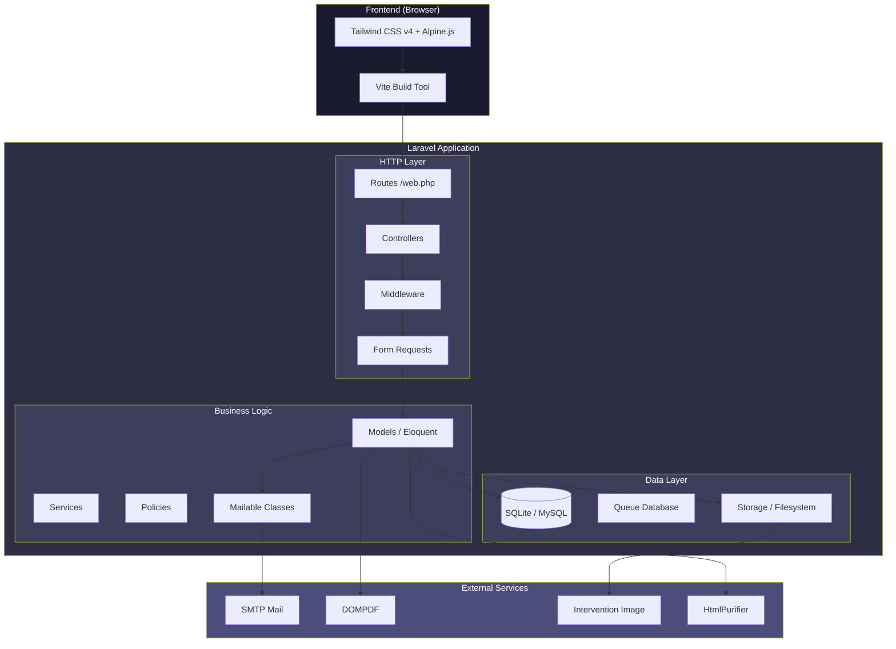

### Request-Response Flow

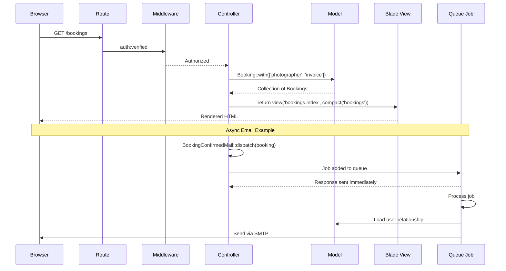

### Database Relationships Summary

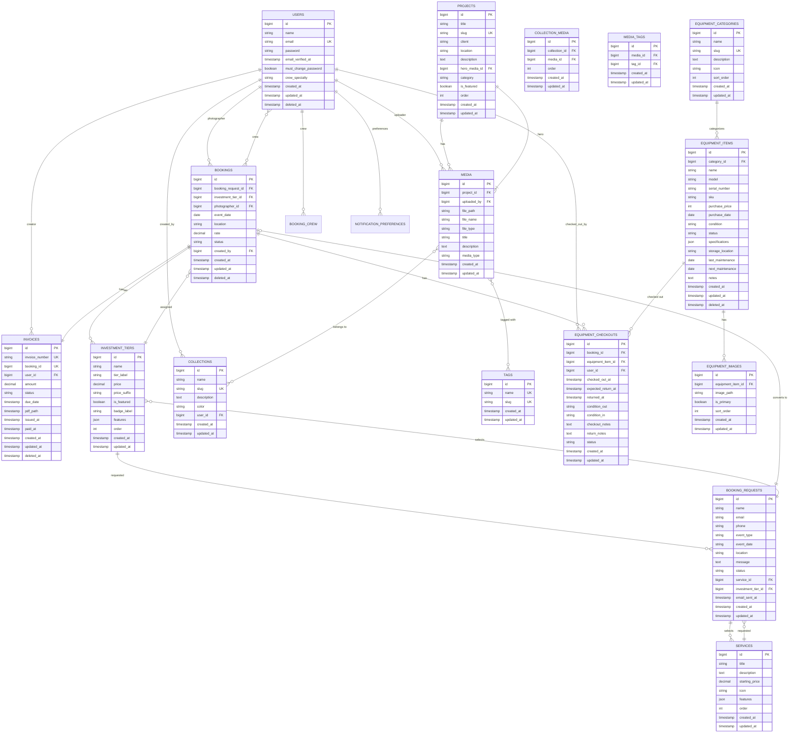

---

## Related Documentation

- [Admin Documentation](ADMIN.md)
- [Manager Documentation](MANAGER.md)
- [Photographer Documentation](PHOTOGRAPHER.md)
- [Public Functionality](PUBLIC.md)
