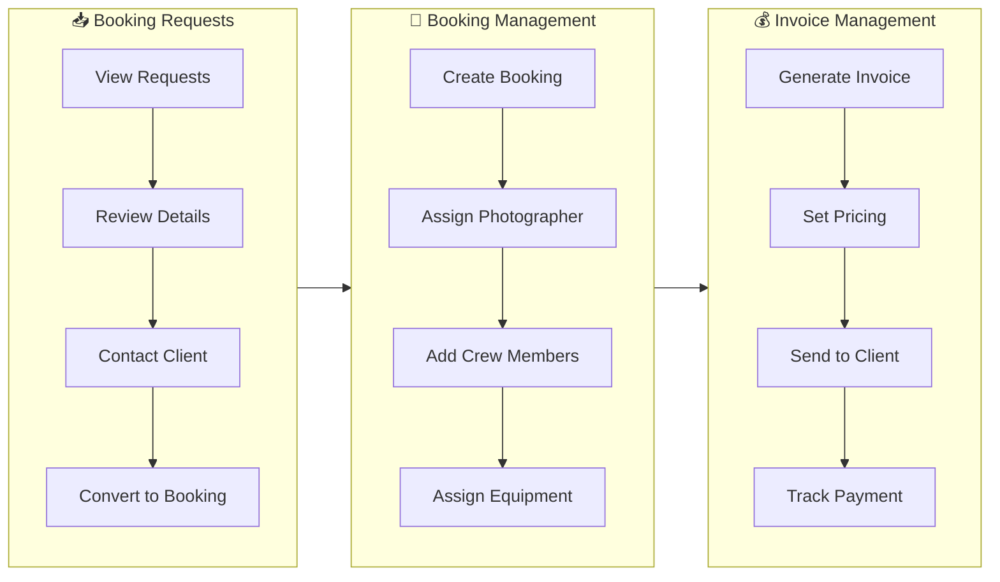
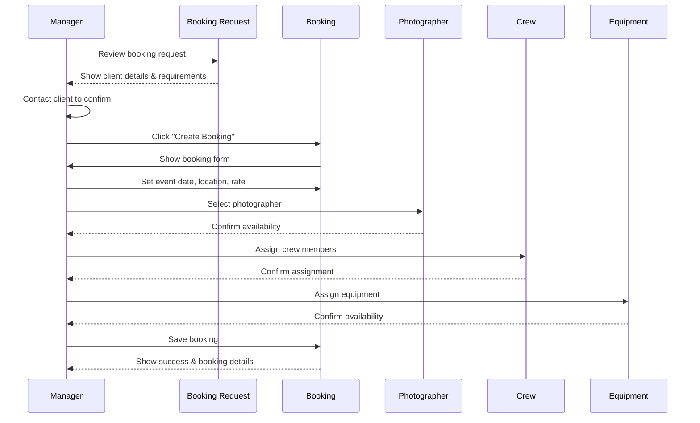
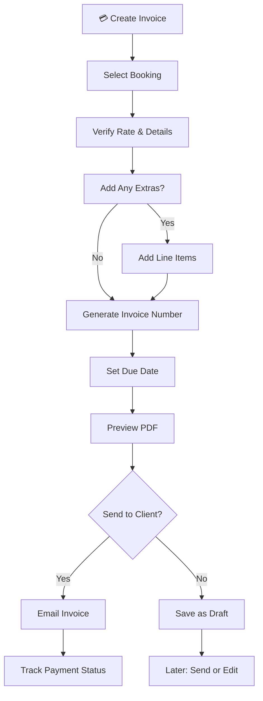
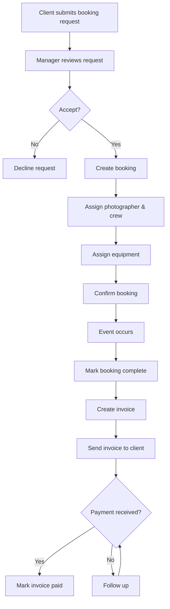

# Odo Studio Manager Documentation

## Overview

This document provides comprehensive documentation for the **Manager role** in the Odo Studio application. Managers handle the day-to-day operations of the photography business, including managing booking requests, creating bookings, assigning crew and equipment, and managing invoices.

---

## Table of Contents

1. [Role Definition & Permissions](#role-definition--permissions)
2. [Authentication & Authorization](#authentication--authorization)
3. [Dashboard](#dashboard)
4. [Booking Requests Management](#booking-requests-management)
5. [Booking Management](#booking-management)
6. [Equipment Assignment](#equipment-assignment)
7. [Invoice Management](#invoice-management)
8. [Viewing Projects & Media](#viewing-projects--media)
9. [Workflow Overview](#workflow-overview)
10. [Rate Limiting](#rate-limiting)
11. [Related Documentation](#related-documentation)

---

## Quick Visual Guide

> 💡 **Tip**: These visual workflows show the most common manager tasks.

### Common Manager Tasks



### Step-by-Step: Converting a Request to Booking



### Step-by-Step: Creating an Invoice



---

## Role Definition & Permissions

### What is a Manager?

The Manager role is responsible for:

- Converting booking requests into confirmed bookings
- Assigning photographers, crew, and equipment to bookings
- Creating and managing invoices
- Tracking revenue and business metrics
- Communicating with clients and crew

### Permissions

Managers have the following permissions:

| Permission | Description |
|------------|-------------|
| `role:manager` | Manager-level access |
| View booking requests | See all pending and processed requests |
| Create bookings | Convert requests to bookings |
| Manage bookings | Update status (confirm, cancel, complete) |
| Assign crew | Add photographers and videographers |
| Assign equipment | Allocate gear to bookings |
| Create invoices | Generate invoices for bookings |
| View invoices | See all invoices |
| Mark invoices paid | Update invoice payment status |
| Download invoice PDFs | Generate PDF versions |

### What Managers Cannot Do

Managers cannot:

- Access admin-only routes
- Modify user roles
- Access system health
- Configure email templates
- Modify site settings
- Delete users permanently
- Restore/force-delete bookings
- Manage equipment inventory (only assign)

---

## Authentication & Authorization

### Login Requirements

Managers must:

1. Have an active user account with the `manager` role assigned
2. Verify their email address
3. Use valid credentials (email + password)

### Middleware Protection

Manager routes use:

```php
Route::middleware(['auth', 'verified', 'role:manager']);
```

### Dashboard Redirect

When a manager visits `/dashboard`, they are redirected to:

```
/manager/dashboard
```

---

## Dashboard

### Access

**URL:** `/manager/dashboard`

**Controller:** `App\Http\Controllers\ManagerController@dashboard`

### Dashboard Statistics

The manager dashboard displays key business metrics:

| Metric | Description | Calculation |
|--------|-------------|-------------|
| Pending Requests | Booking requests awaiting review | Count where status = 'pending' |
| Active Bookings | Confirmed upcoming shoots | Count where status = 'confirmed' |
| Draft Invoices | Invoices not yet sent | Count where status = 'draft' |
| Total Revenue | All paid invoice amounts | Sum of paid invoices |

### Dashboard View

The dashboard provides a quick overview of:

- Recent booking requests
- Upcoming confirmed bookings
- Recent invoices
- Revenue summary

---

## Booking Requests Management

### Access

**URL:** `/manager/requests`

**Controller:** `App\Http\Controllers\BookingRequestController@index`

### Booking Request Model

```php
// app/Models/BookingRequest.php
class BookingRequest extends Model
{
    protected $fillable = [
        'name',
        'surname',
        'email',
        'phone',
        'status',
        'notes',
        'event_date',
        'event_type',
        'event_location',
        'email_sent_at',
        'service_id',
        'investment_tier_id',
    ];
    
    public function booking(): HasOne
    {
        return $this->hasOne(Booking::class);
    }
    
    public function service(): BelongsTo
    {
        return $this->belongsTo(Service::class);
    }
    
    public function investmentTier(): BelongsTo
    {
        return $this->belongsTo(InvestmentTier::class);
    }
    
    public function crew(): BelongsToMany
    {
        return $this->belongsToMany(User::class, 'booking_request_crew')
                    ->withPivot('role');
    }
}
```

### Request Statuses

| Status | Description |
|--------|-------------|
| `pending` | New request, awaiting review |
| `contacted` | Initial contact made |
| `quoted` | Quote sent to client |
| `converted` | Converted to booking |
| `declined` | Declined by manager |
| `expired` | No response, expired |

### Viewing Requests

Managers can view all booking requests:

```bash
GET /manager/requests
```

### Request Detail View

**URL:** `/manager/requests/{bookingRequest}`

The detail view shows:

- Client name and contact information
- Event details (date, type, location)
- Selected service and investment tier
- Additional notes
- Current status
- Associated booking (if converted)
- Assigned crew members

### Converting a Request to a Booking

1. Navigate to `/manager/requests`
2. Click on a pending request
3. Review client details
4. Click "Create Booking"
5. Fill in booking details:
   - Select photographer(s)
   - Assign additional crew (videographers, assistants)
   - Set event date and location
   - Confirm rate
6. Submit to create booking

---

## Booking Management

### Access

**URL:** `/bookings`

**Controller:** `App\Http\Controllers\BookingController`

### Booking Model

```php
// app/Models/Booking.php
class Booking extends Model
{
    use SoftDeletes;
    
    protected $fillable = [
        'booking_request_id',
        'investment_tier_id',
        'photographer_id',
        'event_date',
        'location',
        'rate',
        'status',
        'created_by',
    ];
    
    public function bookingRequest(): BelongsTo
    {
        return $this->belongsTo(BookingRequest::class);
    }
    
    public function photographer(): BelongsTo
    {
        return $this->belongsTo(User::class, 'photographer_id');
    }
    
    public function invoice(): HasOne
    {
        return $this->hasOne(Invoice::class);
    }
    
    public function crew(): BelongsToMany
    {
        return $this->belongsToMany(User::class, 'booking_crew')
                    ->withPivot('role');
    }
    
    public function photographers(): BelongsToMany
    {
        return $this->crew()->wherePivot('role', 'photographer');
    }
    
    public function videographers(): BelongsToMany
    {
        return $this->crew()->wherePivot('role', 'videographer');
    }
    
    public function suggestEquipment(): Collection
    {
        // Suggests equipment based on investment tier
    }
}
```

### Multi-Crew Bookings

A single booking can have multiple crew members:

- **Primary photographer** — Set from the first assigned photographer (backward compatibility)
- **Additional photographers** — Multiple photographers per booking
- **Videographers** — Separate video crew members
- **Assistants** — Support roles

When creating a booking:

```php
// Assign multiple crew members
foreach ($request->crew as $crewMember) {
    $booking->crew()->attach($crewMember['user_id'], [
        'role' => $crewMember['role'] // 'photographer', 'videographer', 'assistant'
    ]);
}
```

Crew confirmation emails are sent to ALL assigned members automatically.

### Booking Statuses

| Status | Description | Can Transition To |
|--------|-------------|-------------------|
| `pending` | Newly created, awaiting confirmation | confirmed, cancelled |
| `confirmed` | Confirmed by manager | completed, cancelled |
| `completed` | Shoot completed | - |
| `cancelled` | Cancelled | - |

### Creating a Booking

**URL:** `/manager/bookings/{bookingRequest}/create`

When creating a booking from a request:

```php
$booking = Booking::create([
    'booking_request_id' => $bookingRequest->id,
    'investment_tier_id' => $request->investment_tier_id,
    'photographer_id' => $request->photographer_id,
    'event_date' => $request->event_date,
    'location' => $request->location,
    'rate' => $request->rate,
    'status' => 'pending',
    'created_by' => auth()->id(),
]);

// Assign crew
if ($request->has('crew')) {
    foreach ($request->crew as $crewMember) {
        $booking->crew()->attach($crewMember['user_id'], ['role' => $crewMember['role']]);
    }
}
```

### Booking Actions

Managers can perform the following actions on bookings:

| Action | Route | Description |
|--------|-------|-------------|
| View | `GET /bookings/{booking}` | View booking details |
| Confirm | `PATCH /bookings/{booking}/confirm` | Mark as confirmed |
| Cancel | `PATCH /bookings/{booking}/cancel` | Cancel booking |
| Complete | `PATCH /bookings/{booking}/complete` | Mark as completed |

### Confirming a Booking

```bash
PATCH /bookings/{booking}/confirm
```

Changes status from `pending` to `confirmed`. Crew members are notified via email.

### Cancelling a Booking

```bash
PATCH /bookings/{booking}/cancel
```

Changes status to `cancelled`. Note: This does not automatically update the invoice.

### Completing a Booking

```bash
PATCH /bookings/{booking}/complete
```

Changes status to `completed`. This typically happens after the shoot is finished.

---

## Equipment Assignment

### Access

**URL:** `/manager/bookings/{booking}/equipment`

**Controller:** `App\Http\Controllers\EquipmentCheckoutController@assign`

### Assigning Equipment to Bookings

Managers can assign equipment to specific bookings:

1. Navigate to a booking detail
2. Click **Assign Equipment**
3. View available equipment (filtered by date availability)
4. Select equipment items
5. Submit — equipment status changes to `checked_out`

### Equipment Availability

Equipment is filtered by availability for the booking's date range:

```php
// Only shows equipment not checked out for the booking dates
EquipmentItem::availableFor($startDate, $endDate)->get();
```

### Specialty-Based Validation

Equipment assignment validates crew specialty:

- **Photography equipment** can only be assigned to photographers
- **Video equipment** can only be assigned to videographers
- **General equipment** can be assigned to any crew member

### Tier-Based Suggestions

The system suggests equipment based on the booking's investment tier:

| Tier | Suggested Equipment |
|------|---------------------|
| Wedding | Cameras, lenses, lighting, audio, support |
| Portrait | Cameras, lenses, lighting |
| Commercial | Cameras, lenses, lighting, audio, support, modifiers |

---

## Invoice Management

### Access

**URL:** `/invoices`

**Controller:** `App\Http\Controllers\InvoiceController`

### Invoice Model

```php
// app/Models/Invoice.php
class Invoice extends Model
{
    use SoftDeletes;
    
    protected $fillable = [
        'booking_id',
        'invoice_number',
        'rate',
        'total_amount',
        'status',
        'notes',
        'pdf_path',
        'issued_at',
        'created_by',
        'paid_at',
    ];
}
```

### Invoice Statuses

| Status | Description |
|--------|-------------|
| `draft` | Not yet sent to client |
| `sent` | Sent to client, awaiting payment |
| `paid` | Payment received |
| `overdue` | Past due date |
| `cancelled` | Cancelled |

### Creating an Invoice

**URL:** `/invoices/{booking}/create`

```php
$invoice = Invoice::create([
    'booking_id' => $booking->id,
    'invoice_number' => Invoice::generateInvoiceNumber(),
    'rate' => $request->rate,
    'total_amount' => $request->total_amount,
    'status' => 'draft',
    'notes' => $request->notes,
    'created_by' => auth()->id(),
]);
```

### Invoice Number Format

Invoices use sequential numbering:

```
INV-000001
INV-000002
INV-000003
...
```

The number is based on the invoice ID with zero-padding.

### Viewing Invoices

**URL:** `/invoices/{invoice}`

Shows invoice details including:

- Invoice number
- Client information (from booking)
- Event details
- Line items
- Total amount
- Status
- Payment history

### Marking Invoice as Paid

**URL:** `PATCH /invoices/{invoice}/pay`

```php
$invoice->update([
    'status' => 'paid',
    'paid_at' => now(),
]);
```

**Rate Limiting:** 20 requests per minute

### Downloading Invoice PDF

**URL:** `/invoices/{invoice}/pdf`

Generates and downloads a PDF version of the invoice.

The PDF is generated using:
- Blade template: `resources/views/invoices/pdf.blade.php`
- PDF library: DomPDF

### Invoice List View

**URL:** `/invoices`

Displays all invoices with:

- Invoice number
- Client name
- Amount
- Status
- Issue date
- Payment date (if paid)

Filters available:
- By status (draft, sent, paid, overdue)
- By date range

---

## Viewing Projects & Media

### Portfolio

Managers can view the public portfolio:

**URL:** `/portfolio`

Shows all published projects and media items.

### Project Detail

**URL:** `/portfolio/{project:slug}`

Shows individual project with:
- Hero image
- All project media
- Project description
- Client information

### Media Library

Managers can view the media library:

**URL:** `/admin/media`

- Browse all media items
- Filter by collection, tag, or type
- Search by title or filename
- View media assigned to projects

---

## Workflow Overview

### Complete Booking Workflow



### Step-by-Step Process

#### Step 1: Receive Booking Request

1. Client visits `/contact`
2. Fills out booking request form
3. Submits form (rate-limited: 5/minute)
4. Request stored in database
5. Admin/manager notified via email

#### Step 2: Review Request

1. Manager visits `/manager/requests`
2. Reviews client details
3. Reviews event requirements
4. Decides to accept or decline

#### Step 3: Create Booking

1. Manager clicks "Create Booking"
2. Selects investment tier
3. Assigns primary photographer
4. Assigns additional crew (optional)
5. Sets event date and location
6. Confirms rate

#### Step 4: Assign Equipment

1. Manager navigates to booking equipment page
2. Views available equipment for the date range
3. Selects equipment items
4. Equipment is validated against crew specialty
5. Equipment status changes to `checked_out`

#### Step 5: Confirm Booking

1. Manager clicks "Confirm" on booking
2. Booking status changes to `confirmed`
3. Photographer and crew notified via email
4. Client can be notified (if configured)

#### Step 6: Complete Booking

1. After event, manager marks as completed
2. Booking status changes to `completed`

#### Step 7: Create Invoice

1. Manager visits booking detail
2. Clicks "Create Invoice"
3. Enters amount and notes
4. Submits to create invoice

#### Step 8: Send Invoice

1. Manager can download PDF
2. Sends to client via email (external)
3. Updates status to `sent` (optional)

#### Step 9: Receive Payment

1. Client pays invoice
2. Manager marks as paid
3. Invoice status changes to `paid`
4. Revenue calculated in dashboard

---

## Rate Limiting

Manager actions are rate-limited:

| Action | Limit | Window |
|--------|-------|--------|
| Create booking | 10 | 1 minute |
| Create invoice | 10 | 1 minute |
| Mark invoice paid | 20 | 1 minute |
| Mark invoice sent | 20 | 1 minute |

---

## Related Documentation

- [Admin Documentation](ADMIN.md)
- [Photographer Documentation](PHOTOGRAPHER.md)
- [Public Functionality](PUBLIC.md)
- [System Architecture](ARCHITECTURE.md)
