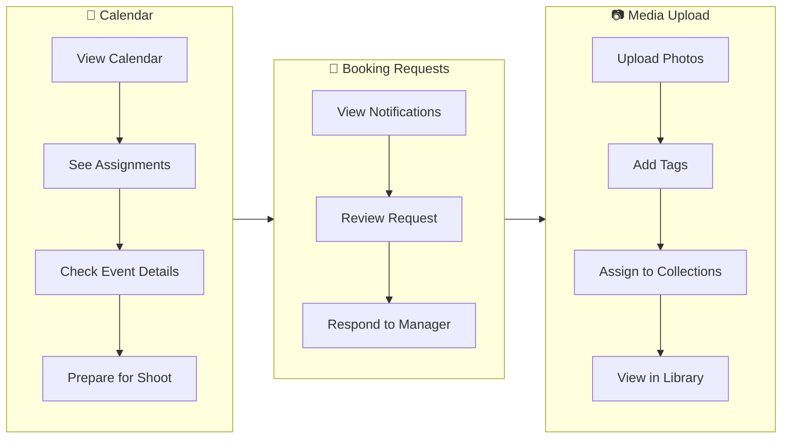
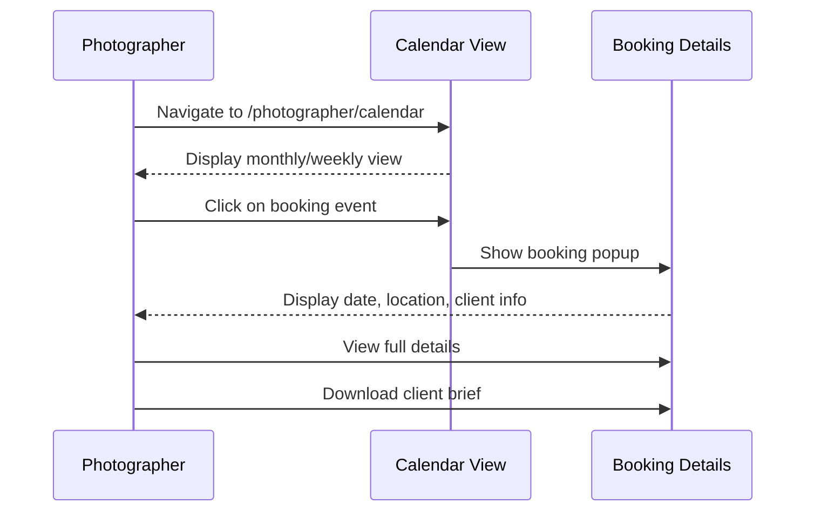
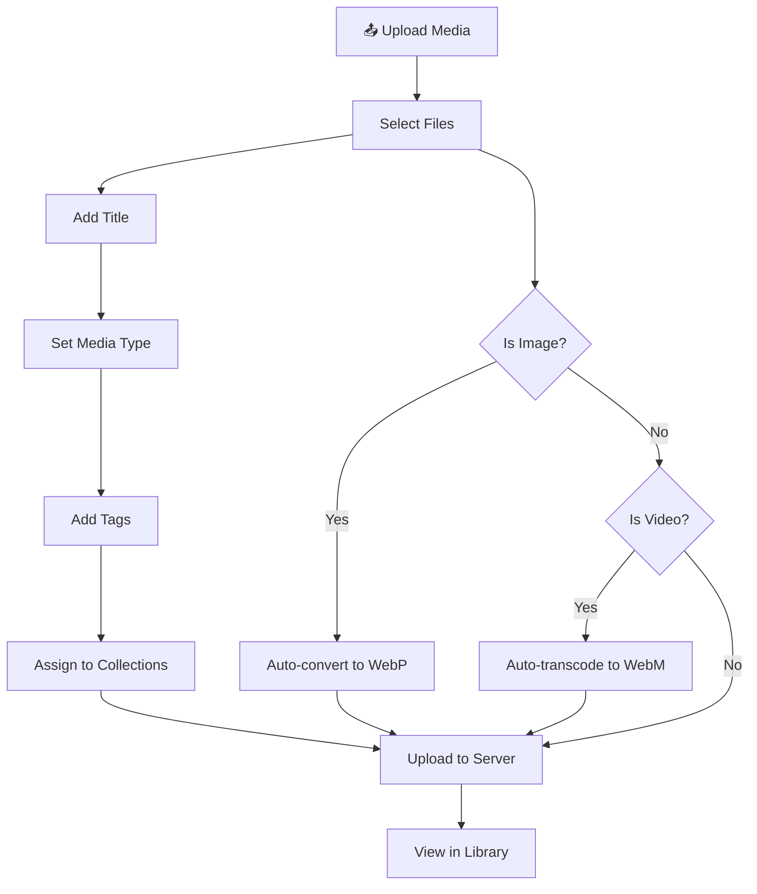
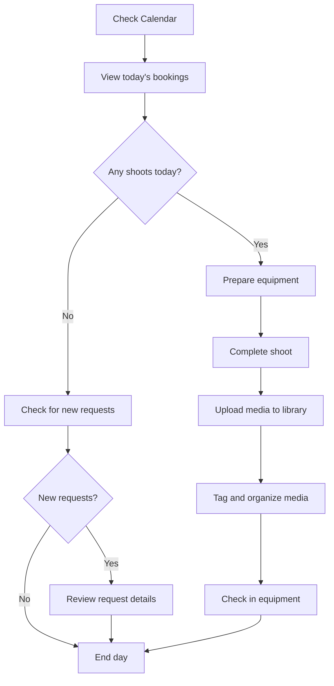

# Odo Studio Photographer Documentation

## Overview

This document provides comprehensive documentation for the **Crew role** (formally `crew`) in the Odo Studio application. Crew members (photographers and videographers) can view their assigned bookings on a calendar, manage booking requests they're notified about, upload media to the library, configure their notification preferences, and manage equipment check-ins.

---

## Table of Contents

1. [Role Definition & Permissions](#role-definition--permissions)
2. [Authentication & Authorization](#authentication--authorization)
3. [Calendar View](#calendar-view)
4. [Booking Requests](#booking-requests)
5. [Media Management](#media-management)
6. [Notification Preferences](#notification-preferences)
7. [Viewing Bookings](#viewing-bookings)
8. [Viewing Invoices](#viewing-invoices)
9. [Equipment Check-In](#equipment-check-in)
10. [Workflow Overview](#workflow-overview)
11. [Related Documentation](#related-documentation)

---

## Quick Visual Guide

> 💡 **Tip**: These visual workflows show the most common crew tasks.

### Common Crew Tasks



### Step-by-Step: Viewing & Managing Calendar



### Step-by-Step: Uploading Media



---

## Role Definition & Permissions

### What is a Crew Member?

The Crew role (formally `crew`) includes photographers and videographers:

- Viewing assigned bookings on a calendar
- Receiving notifications for new booking requests
- Uploading media to the library
- Managing notification preferences
- Viewing their own bookings and invoices
- Checking in equipment

### Permissions

Crew members have the following permissions:

| Permission | Description |
|------------|-------------|
| `role:crew` | Crew access |
| View calendar | See assigned bookings |
| View requests | See booking requests |
| Upload media | Add media to library |
| Update preferences | Configure notifications |
| View own bookings | See assigned bookings |
| View own invoices | See invoices for bookings they're on |
| Check in equipment | Return assigned gear |

### What Crew Members Cannot Do

Crew members cannot:

- Access admin routes
- Create bookings from requests
- Manage invoices (except viewing own)
- Modify services, projects, testimonials
- Access user management
- Configure site settings or email templates

---

## Authentication & Authorization

### Login Requirements

Crew members must:

1. Have an active user account with the `crew` role assigned
2. Verify their email address
3. Use valid credentials (email + password)

### Middleware Protection

Crew routes use:

```php
Route::middleware(['auth', 'verified', 'role:crew']);
```

### Dashboard Redirect

When a crew member visits `/dashboard`, they are redirected to:

```
/photographer/calendar
```

---

## Calendar View

### Access

**URL:** `/photographer/calendar`

**Controller:** `App\Http\Controllers\BookingController@calendar`

### Calendar Features

The photographer calendar displays:

- All bookings where the crew member is assigned
- Event dates clearly marked
- Event locations
- Client names
- Event types

### Calendar Events Endpoint

**URL:** `/photographer/calendar/events`

**Controller:** `App\Http\Controllers\BookingController@calendarEvents`

Returns JSON for calendar rendering:

```json
[
    {
        "id": 1,
        "title": "Johnson Wedding",
        "start": "2024-06-15",
        "end": "2024-06-16",
        "location": "Stellenbosch, Cape Town",
        "client": "John & Jane Johnson",
        "status": "confirmed",
        "url": "/bookings/1"
    }
]
```

### Calendar Display

The calendar uses FullCalendar to display:

- Month view
- Week view
- Day view
- Upcoming events list

### Booking Details from Calendar

Clicking a calendar event navigates to booking detail:

```
/bookings/{booking_id}
```

---

## Booking Requests

### Access

**URL:** `/photographer/requests`

**Controller:** `App\Http\Controllers\BookingRequestController@index`

### Notification System

Crew members can receive notifications when new booking requests come in:

1. Admin/manager configures which crew members receive notifications
2. When a new request is submitted, notification emails are sent
3. Crew members can view all requests they're notified about

### Viewing Requests

Crew members can view booking requests that match their notification preferences:

```bash
GET /photographer/requests
```

### Request Detail

**URL:** `/photographer/requests/{bookingRequest}`

Shows:
- Client name and contact
- Event details
- Selected service/tier
- Notes
- Current status

### Limitations

Crew members can only view requests - they cannot:
- Convert requests to bookings
- Change request status
- Delete requests

---

## Media Management

### Access

**URL:** `/admin/media`

**Controller:** `App\Http\Controllers\MediaController`

Crew members share access to the media library with admins.

### Media Upload

**Method:** `POST /admin/media`

Crew members can upload:

| Type | Formats | Notes |
|------|---------|-------|
| Images | JPEG, PNG, WebP, GIF | Auto-converted to WebP |
| Videos | MP4, MOV, WebM | Auto-transcoded to WebM |

### Upload Fields

| Field | Type | Required | Description |
|-------|------|----------|-------------|
| `file` | file | Yes | The media file |
| `title` | string | No | Media title |
| `media_type` | select | Yes | image/video/gif |
| `tags` | string | No | Comma-separated tags |
| `collections[]` | array | No | Collection IDs to assign |

### Media Types

The system automatically detects:

- `image` - Static images
- `gif` - Animated GIFs
- `video` - Video files

### Tags

Tags are flexible labels for organizing media:

- Enter comma-separated tags during upload (e.g., `wedding, couple, reception`)
- New tags are created automatically if they don't exist
- Filter media by tags in the library sidebar
- Tags appear on portfolio items for public filtering

### Collections

Collections are virtual albums for grouping media:

- Assign media to one or more collections during upload
- Edit media to change collection assignments
- Filter media by collection in the library sidebar

### Uploaded By Tracking

All uploaded media is associated with the uploader:

```php
$media = Media::create([
    // ... other fields
    'uploaded_by' => auth()->id(),
]);
```

### Editing Media

Crew members can edit media they uploaded:

- Update title and description
- Add or remove tags
- Change collection assignments

### Deleting Media

Crew members can only delete media they uploaded:

```php
// Policy check
if (auth()->user()->can('delete', $media)) {
    $media->delete();
}
```

---

## Notification Preferences

### Access

**URL:** `/photographer/preferences`

**Controller:** `App\Http\Controllers\NotificationPreferenceController`

### Notification Preference Model

```php
// app/Models/NotificationPreference.php
class NotificationPreference extends Model
{
    protected $fillable = [
        'user_id',
        'notify_new_requests',
    ];
    
    public function user(): BelongsTo
    {
        return $this->belongsTo(User::class);
    }
}
```

### Preferences Options

| Setting | Type | Description |
|---------|------|-------------|
| `notify_new_requests` | boolean | Receive email for new booking requests |

### Updating Preferences

**Method:** `PATCH /photographer/preferences`

```php
$preference->update([
    'notify_new_requests' => $request->boolean('notify_new_requests'),
]);
```

### Email Notifications

When enabled, crew members receive emails for:

- New booking requests matching their specialty
- Booking confirmations where they're assigned
- Booking completions

---

## Viewing Bookings

### Access

**URL:** `/bookings`

**Controller:** `App\Http\Controllers\BookingController@index`

### Crew Booking Access

Crew members can only view bookings where they are:

1. The primary photographer (`photographer_id`)
2. A crew member (`booking_crew` table)

### Booking Information Visible

Crew members can see:

- Event date and time
- Event location
- Client information
- Investment tier details
- Other crew members
- Booking status
- Associated invoice (view only)

### Booking Actions

Crew members can view bookings but cannot:

- Change booking status
- Edit booking details
- Cancel bookings

These actions require manager or admin role.

---

## Viewing Invoices

### Access

**URL:** `/invoices`

**Controller:** `App\Http\Controllers\InvoiceController@index`

### Invoice Visibility for Crew

Crew members can only view invoices for bookings they're assigned to:

```php
// Policy check
public function viewAny(User $user): bool
{
    // Managers can see all
    if ($user->hasRole('manager') || $user->hasRole('admin')) {
        return true;
    }
    
    // Crew can only see their own
    $userBookingIds = $user->bookings()->pluck('bookings.id');
    return Invoice::whereIn('booking_id', $userBookingIds)->exists();
}
```

### Invoice Details

Crew members can see:

- Invoice number
- Booking details
- Amount
- Status
- Issue date

Crew members cannot:
- Create invoices
- Edit invoices
- Mark as paid
- Delete invoices

---

## Equipment Check-In

### Access

**URL:** `/photographer/my-gear`

**Controller:** `App\Http\Controllers\EquipmentCheckoutController@myGear`

### Viewing Assigned Equipment

Crew members can see all equipment currently checked out to them:

- Equipment name and model
- Booking it was assigned to
- Expected return date
- Condition when checked out
- Overdue status

### Checking In Equipment

1. Navigate to **My Gear**
2. Find the equipment item to return
3. Click **Check In**
4. Record:
   - Current condition
   - Any notes about the equipment
5. Submit — equipment status updates to `available`

### Overdue Equipment

Equipment past its expected return date is flagged as overdue. Managers and admins can view the overdue report at `/admin/equipment/reports/overdue`.

---

## Workflow Overview

### Crew Daily Workflow



### Step-by-Step Process

#### 1. Check Calendar

1. Log in to Odo Studio
2. Automatic redirect to calendar view
3. See upcoming assignments
4. Click event for details

#### 2. Review Assignment Details

1. Click on booking in calendar
2. Review:
   - Client name and contact
   - Event date and time
   - Location
   - Investment tier
   - Other crew members
3. Note any special requirements

#### 3. Complete Shoot

1. Arrive at location
2. Complete photography/videography
3. Note any issues or special moments

#### 4. Upload Media

1. Navigate to `/admin/media`
2. Upload raw/edited photos
3. Add titles and descriptions
4. Add tags for organization (e.g., `wedding, couple, reception`)
5. Assign to collections if applicable

#### 5. Check In Equipment

1. Visit `/photographer/my-gear`
2. Review assigned equipment
3. Check in each item with condition notes

#### 6. Check New Requests (Optional)

1. Visit `/photographer/requests`
2. Review incoming leads
3. Discuss with manager if interested

---

## User Model Attributes

Crew members have additional attributes:

```php
$user->crew_specialty;  // Specialty: photographer, videographer, or both
```

### Specialty Values

| Value | Description |
|-------|-------------|
| `photographer` | Still photography only |
| `videographer` | Video production only |
| `both` | Can work as either |

This helps managers assign the right crew to bookings and ensures proper equipment allocation.

---

## Related Documentation

- [Admin Documentation](ADMIN.md)
- [Manager Documentation](MANAGER.md)
- [Public Functionality](PUBLIC.md)
- [System Architecture](ARCHITECTURE.md)
