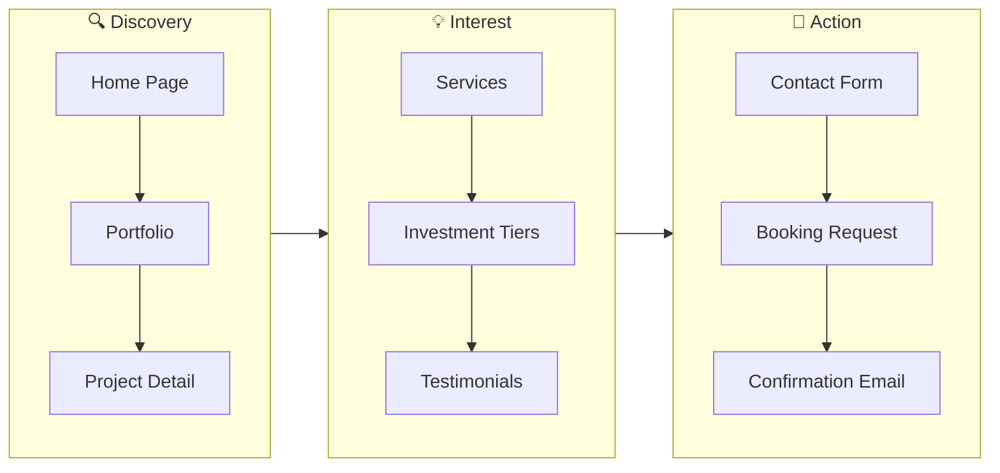
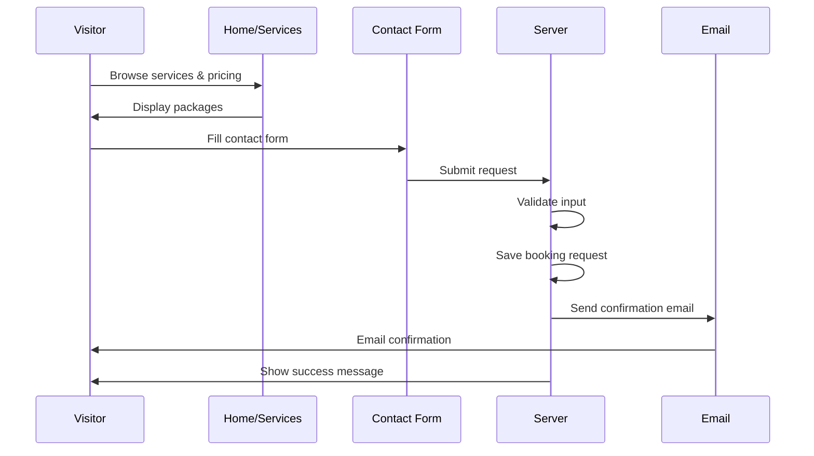
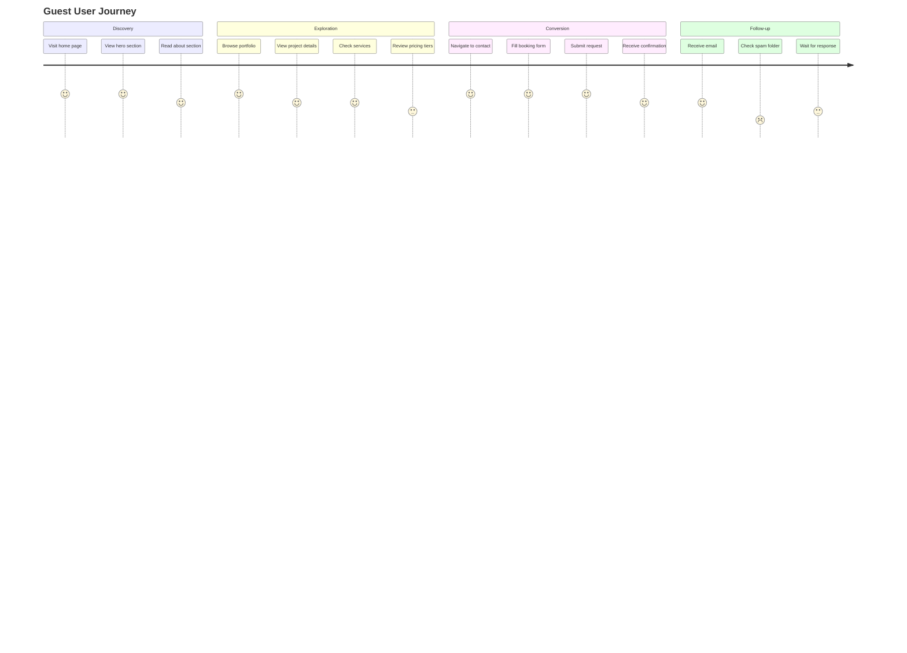
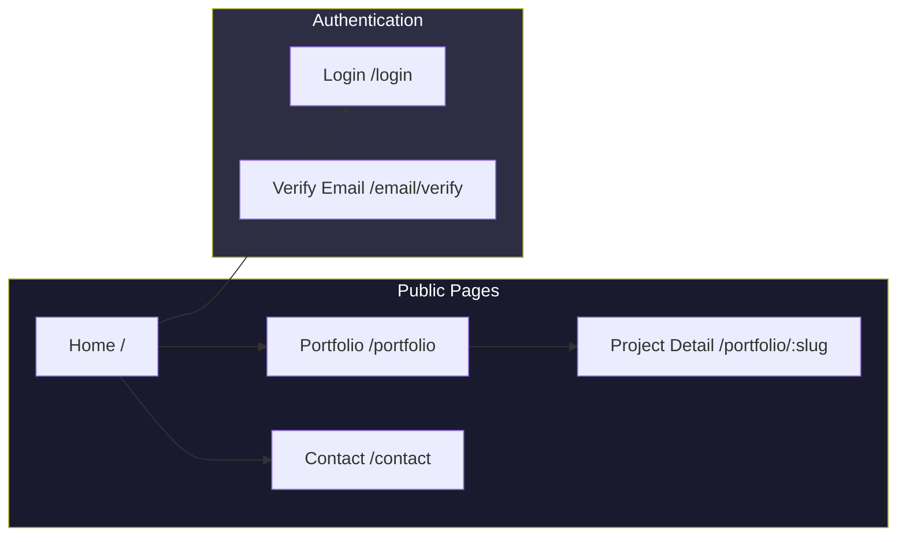
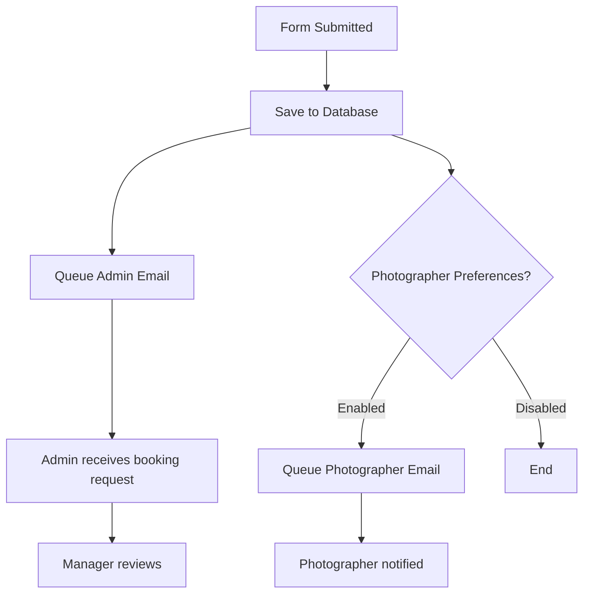

# Odo Studio Public Functionality Documentation

## Overview

This document describes all functionality available to public users (guests) who are not logged in to the Odo Studio application. This includes browsing the portfolio, viewing the home page, and submitting booking requests.

---

## Table of Contents

1. [Public Pages Overview](#public-pages-overview)
2. [Home Page](#home-page)
3. [Portfolio](#portfolio)
4. [Portfolio Project Detail](#portfolio-project-detail)
5. [Contact / Booking Request](#contact--booking-request)
6. [Sitemap](#sitemap)
7. [Authentication](#authentication)
8. [Rate Limiting](#rate-limiting)
9. [Related Documentation](#related-documentation)

---

## Quick Visual Guide

> 💡 **Tip**: This shows how public users interact with Odo Studio.

### Public User Journey



### Booking Request Flow



---

## Public Pages Overview

Odo Studio provides several public-facing pages that require no authentication:

| Route | Page | Description |
|-------|------|-------------|
| `/` | Home | Main landing page |
| `/portfolio` | Portfolio | Gallery of projects |
| `/portfolio/{slug}` | Project Detail | Individual project |
| `/contact` | Contact | Booking request form |
| `/sitemap.xml` | Sitemap | XML sitemap for SEO |
| `/login` | Login | User authentication |

### User Journey Map



### Site Navigation Flow



---

## Home Page

### Access

**URL:** `/`

**Controller:** Default welcome view

### Home Page Sections

The home page typically includes:

#### 1. Hero Section

- Full-screen hero with background image/video
- Main headline (configurable via site settings)
- Subheadline/tagline
- Call-to-action button

#### 2. Services Section

Displays all active services from the database:

```php
// Retrieve services
$services = Service::orderBy('order')->get();
```

Each service displays:
- Icon
- Title
- Description
- Starting price
- Features list

#### 3. Process Steps Section

Shows the workflow/process:

```
01. Discovery Call
02. Custom Proposal
03. The Shoot
04. Post-Production
```

#### 4. Investment Tiers Section

Displays pricing packages:

| Tier | Features | Price |
|------|----------|-------|
| Basic | Core coverage | From R5,000 |
| Standard | Full day + extras | From R10,000 |
| Premium | Complete package | From R15,000 |

Featured tier is highlighted.

#### 5. Testimonials Section

Client testimonials:

- Client name
- Event type
- Star rating
- Quote

#### 6. Contact CTA

Call-to-action to visit contact page.

---

## Portfolio

### Access

**URL:** `/portfolio`

**Controller:** `App\Http\Controllers\MediaController@portfolio`

### Portfolio Features

#### Grid Layout

The portfolio uses an artistic grid layout displaying both projects and standalone media items.

#### Tag Filtering

Users can filter portfolio items by tags:

```
All Works | Wedding | Portrait | Commercial | ...
```

Filtering uses query parameters:

```
/portfolio?tag=wedding
```

Tags are applied to media items by admins and crew during upload. Each tag has a unique slug used for filtering.

#### Portfolio Items

The portfolio displays:

1. **Projects** (Case Studies)
   - Featured projects with hero images
   - Title, category, location
   - "Case Study" badge

2. **Standalone Media**
   - Individual photos/videos not assigned to projects
   - Title and tags
   - Filterable by tag

### Fallback Display

When no image is available:

- Gradient background (various colors)
- Random geometric symbol (✦, ◇, ○, □, etc.)
- Title and tags on hover

### Hover Overlay

When hovering over portfolio items:

- Dark gradient overlay
- Tag labels (small, gold)
- Project title
- "Explore →" link for projects

---

## Portfolio Project Detail

### Access

**URL:** `/portfolio/{project:slug}`

**Controller:** `App\Http\Controllers\MediaController@showProject`

### Project Detail Features

#### Hero Section

- Large featured image
- Project title overlay

#### Project Information

- Client name
- Location
- Category
- Description (HTML supported)

#### Media Gallery

All project media displayed in grid:

- Images
- Videos (with play button)
- GIFs

#### Related Projects

Links to other portfolio items (optional).

### Project Model

```php
// app/Models/Project.php
class Project extends Model
{
    protected $fillable = [
        'title',
        'slug',
        'client',
        'location',
        'description',
        'hero_media_id',
        'category',
        'is_featured',
        'order',
    ];
    
    public function media(): HasMany
    {
        return $this->hasMany(Media::class);
    }
    
    public function hero(): BelongsTo
    {
        return $this->belongsTo(Media::class, 'hero_media_id');
    }
}
```

---

## Contact / Booking Request

### Access

**URL:** `/contact`

**Controller:** `App\Http\Controllers\BookingRequestController@showForm`

### Booking Request Form

The contact page displays a form with:

#### Personal Information

| Field | Type | Required | Validation |
|-------|------|----------|------------|
| Name | text | Yes | Min 2 chars |
| Surname | text | Yes | Min 2 chars |
| Email | email | Yes | Valid email |
| Phone | tel | Yes | Valid phone |

#### Event Details

| Field | Type | Required | Options |
|-------|------|----------|---------|
| Event Type | select | Yes | Wedding, Portrait, Commercial, etc. |
| Event Date | date | Yes | Future dates |
| Location | text | Yes | Event location |

#### Service Selection

| Field | Type | Required |
|-------|------|----------|
| Interested Service | select | No |
| Investment Tier | select | No |

#### Additional Information

| Field | Type | Required |
|-------|------|----------|
| Notes | textarea | No |

### Form Submission

**Method:** `POST /contact`

**Controller:** `App\Http\Controllers\BookingRequestController@store`

**Rate Limiting:** 5 requests per minute (per IP)

### Validation

```php
// BookingRequestFormRequest
public function rules(): array
{
    return [
        'name' => 'required|string|min:2',
        'surname' => 'required|string|min:2',
        'email' => 'required|email',
        'phone' => 'required|string',
        'event_type' => 'required|string',
        'event_date' => 'required|date|after:today',
        'event_location' => 'required|string',
        'service_id' => 'nullable|exists:services,id',
        'investment_tier_id' => 'nullable|exists:investment_tiers,id',
        'notes' => 'nullable|string|max:1000',
    ];
}
```

### After Submission

1. Booking request saved to database
2. Admin notified via email (if configured)
3. Photographers notified based on preferences
4. Client sees success message
5. Optional: Client receives confirmation email

### Email Notification Flow



---

## Sitemap

### Access

**URL:** `/sitemap.xml`

**Controller:** `App\Http\Controllers\SitemapController@index`

### Sitemap Contents

The XML sitemap includes:

- Home page
- Portfolio page
- Contact page
- All portfolio projects
- Static pages

### Sitemap Format

```xml
<?xml version="1.0" encoding="UTF-8"?>
<urlset xmlns="http://www.sitemaps.org/schemas/sitemap/0.9">
    <url>
        <loc>https://example.com/</loc>
        <changefreq>weekly</changefreq>
        <priority>1.0</priority>
    </url>
    <url>
        <loc>https://example.com/portfolio</loc>
        <changefreq>weekly</changefreq>
        <priority>0.9</priority>
    </url>
    <!-- ... -->
</urlset>
```

### SEO Benefits

- Helps search engines index all pages
- Shows last modification dates
- Sets priority for crawl budget

---

## Authentication

### Login

**URL:** `/login`

**Features:**
- Email and password
- "Remember me" option
- Forgot password link

### Registration

**URL:** `/register`

**Note:** Registration is typically disabled in production. Only invited users should register.

### Password Reset

**URL:** `/forgot-password`

Users can request password reset link via email.

### Email Verification

New users must verify email before full access:

**URL:** `/verify-email`

---

## Rate Limiting

Public endpoints have rate limiting:

| Endpoint | Limit | Window |
|----------|-------|--------|
| POST /contact | 5 | 1 minute |
| POST /login | 5 | 1 minute |
| POST /forgot-password | 5 | 1 minute |

Rate limiting helps prevent:
- Spam submissions
- Brute force attacks
- Server overload

---

## User Model (Public Context)

### Public User Information

When users submit booking requests, they provide:

```php
$request->name;        // First name
$request->surname;     // Last name
$request->email;       // Contact email
$request->phone;       // Contact phone
```

This data is stored in `booking_requests` table - not in the `users` table.

### Guest vs Authenticated

- **Guests** can submit booking requests
- **Authenticated users** can manage bookings, view dashboards
- **Admins/Managers/Crew** have role-based access

---

## Related Documentation

- [Admin Documentation](ADMIN.md)
- [Manager Documentation](MANAGER.md)
- [Photographer Documentation](PHOTOGRAPHER.md)
- [System Architecture](ARCHITECTURE.md)
